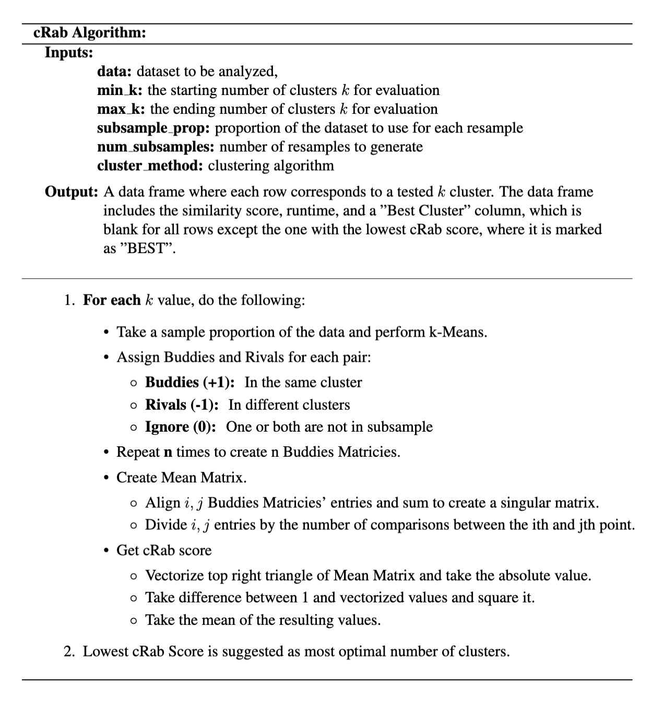
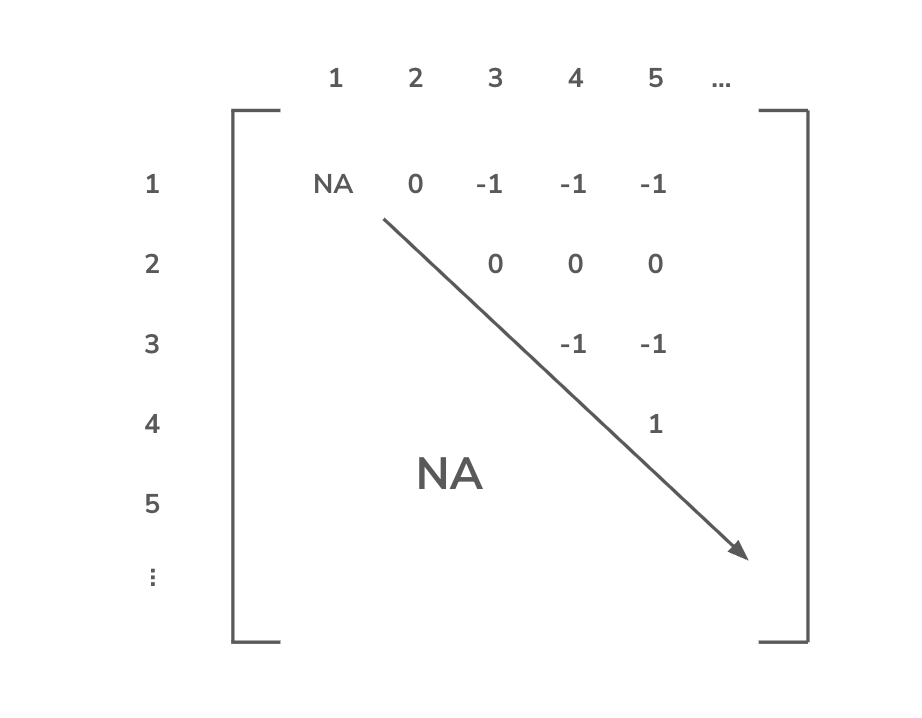
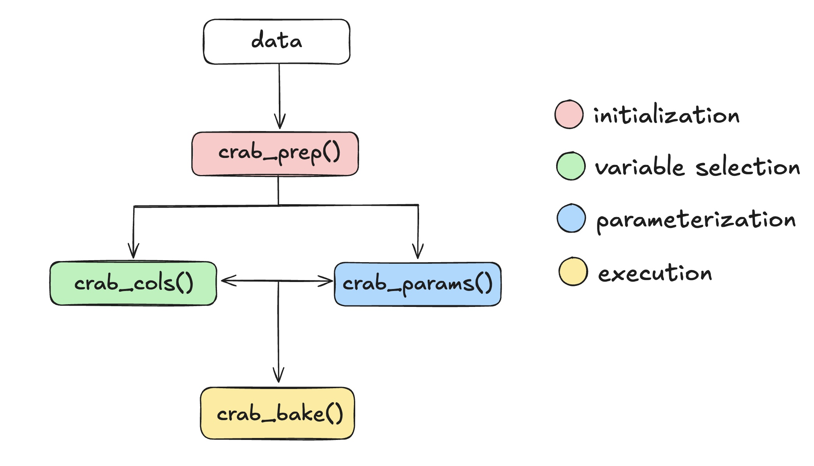

---
format:
  pdf:
    documentclass: report
    papersize: letter
    fontsize: 12pt
    mainfont: Times New Roman
    geometry:
      - left=1.5in
      - right=1in
      - top=1in
      - bottom=1in
    include-before-body:
      - frontmatter/information.tex
      - frontmatter/title-page.tex
      - frontmatter/copyright-page.tex
      - frontmatter/committee-page.tex
      - frontmatter/abstract.tex
      - frontmatter/acknowledgments.tex
      - frontmatter/table-of-contents.tex
    number-sections: true
    citation-style: apa
    bibliography: bibliography/example-bibliography.bib
    csl: bibliography/apa-6th-edition.csl
    include-in-header: frontmatter/formating.tex
---

```{r}
#| lablel: set-up
#| include: false # Use to hide code and results

# hidden code chunk for libraries + data
library(tidyverse)
library(kableExtra)
library(tidyclust)
library(tidymodels)
library(foreach)
library(doParallel)
library(MASS)
library(gt)

doParallel::registerDoParallel(cores = detectCores() - 5)
penguins_data <- penguins

source("functions.R/functions.R")
```

# Introduction

## Motivation
Unsupervised learning is a type of machine learning where data is unlabeled 
and the true target variable is unknown. It is commonly used to identify groups 
of observations, reduce dimensionality, or detect anomalies within data. While 
these methods can reveal meaningful structure in data, they are inherently difficult
to evaluate because there is no ground truth to compare against, unlike in 
supervised learning.

A widely used approach within unsupervised learning is K-means, a type of clustering 
algorithm. This algorithm initializes $k$ centroids in the data space and assigns
each point to the nearest centroid based on Euclidean distance. The centroids are then 
updated as the mean of their assigned points and this process is repeated 
until the cluster assignments stabilize. Despite its simplicity, K-means has notable
limitations. One flaw is the final clustering depends heavily on the initial placements
of the centroids (Jaeger), which can lead to inconsistent or suboptimal results.
Additionally, the use of Euclidean distance assumes that the clusters 
themselves are roughly spherical, an assumption that often fails for real-world 
data.

A major challenge in clustering as a whole is determining the appropriate number 
of clusters. Without prior knowledge, this choice can significantly affect the 
outcome, and different methods often suggest different answers. Two of the most 
commonly used techniques are the Elbow Method and the Silhouette Score.

## Current Methods
The Elbow Method is a visual approach that evaluates clustering by calculating the
within-cluster sum of squares (WCSS). This measures the sum of squared Euclidean 
distances between each point and its assigned cluster centroid for different 
values of $k$. As the number of clusters increases, the WCSS naturally decreases 
because smaller clusters reduce within-cluster variation. The optimal number of
clusters is typically identified at the point where the decrease in WCSS slows 
dramatically and begins to level off, forming what is known as the "elbow". The 
value of $k$ just before this plateau is then chosen as the correct number of clusters.
Although this method works well when the elbow is clearly visible, it does not always
provide a clear answer (Kodinariya). 

```{r}
#| label: data-example1
#| echo: false # Use to hide code but not results
#| tbl-cap: "Data Example"
#| include: false

# set seed for recreation
set.seed(590)

# number of observations per cluster
n <- 200

# generate points from mvnorm disb'n
sigma1 <- matrix(c(2.5, -2.3,
                   -2.3, 2.75), nrow = 2)  # very elongated

cluster1 <- mvrnorm(n, mu = c(1, 0), 
                    Sigma = sigma1)

# generate points from mvnorm disb'n
sigma2 <- matrix(c(4, -2.5,
                   -2.5, 2), nrow = 2)
cluster2 <- mvrnorm(n, mu = c(1, -6), 
                    Sigma = sigma2)

# generate points from mvnorm disb'n
sigma3 <- matrix(c(3.2, -3.3,
                   -3.3, 3.5), nrow = 2)
cluster3 <- mvrnorm(n, mu = c(1, 5), 
                    Sigma = sigma3)

# join points to create data frame
df <- data.frame(
  x = c(cluster1[,1], cluster2[,1], cluster3[,1]),
  y = c(cluster1[,2], cluster2[,2], cluster3[,2]),
  cluster = factor(rep(c("Cluster 1"),
                       each = n)))

df |>
  ggplot(aes(x = x, y = y)) +
  geom_point() +
  theme_minimal() +
  labs(x = "x",
       y = "y",
       title = "Data Examples 1")

```


```{r}
#| label: elbow-method graph example
#| echo: false # Use to hide code but not results
#| fig-cap: "Elbow Method Graph using WCSS"

# set seed for recreation
set.seed(590)

# grab x and y cols from data frame
X <- as.matrix(df[, c("x", "y")])

# get wcss
wcss <- sapply(1:10, function(k) {
  kmeans(X, centers = k, nstart = 25)$tot.withinss})

# create data frame of wcss
elbow_df <- data.frame(
  k = 1:10,
  wcss = wcss)

# plot elbow method
elbow_df |>
  ggplot(aes(x = k, y = wcss)) +
  geom_point() +
  geom_line() +
  theme_minimal() +
  labs(title = "Elbow Method Graph Using Total WCSS",
       x = "Number of Clusters (k)",
       y = NULL) +
  scale_x_continuous(breaks = 1:10)
```
Figure 1.1 illustrates a case where WCSS decreases gradually for all values of $k$, 
making it difficult to identify a distinct elbow. Without a clear plateau to guide 
the decision, selecting the optimal number of clusters becomes subjective and can 
lead to very different results depending on the value of $k$ that is chosen.

In contrast to the Elbow Method, the Silhouette Score provides a more quantitative
approach by removing the subjectivity of visual interpretation. Instead of relying 
on a plot, it judges clusters using a mathematical measure and selects the number of
clusters based on the global maximum which corresponds to well separated and cohesive 
clusters. However, this method introduces its own limitation due to the assumptions 
it makes about cluster structure.

The Silhouette Score is defined as:
$$
s(i) = \frac{b(i) - a(i)}{\max(a(i), b(i))}
$$
where $a(i)$ is the average distance between point $i$ and all other points in 
the same cluster, and $b(i)$ is the average distance between point $i$ and points
in the nearest neighboring cluster. 

Intuitively, this measure evaluates how well a point fits within its assigned 
cluster compared to others. Because of its formulation, the Silhouette Score 
favors compact and well separated clusters. As a result, it performs well when 
clusters are roughly uniform in shape, but struggles with oddly shaped or elongated 
structures that real data tends to resemble. Additionally, maximizing the global 
score can bias the method toward a solution with fewer clusters, prioritizing 
separation over accurately capturing the underlying structure. This limitation is 
illustrated in Figures 1.2 and 1.3.

```{r}
#| label: ss graph data
#| echo: false # Use to hide code but not results
#| fig-cap: "Silhouette Score Data"

set.seed(590)
n <- 200

# cluster 1
ss_sigma1 <- matrix(c(2.5, 2,
                   2, 2.5), 
                 nrow = 2)
ss_cluster1 <- mvrnorm(n, mu = c(4, -10), 
                    Sigma = ss_sigma1)

# cluster 2
ss_sigma2 <- matrix(c(3, 2.5,
                   2.5, 3), 
                 nrow = 2)
ss_cluster2 <- mvrnorm(n, mu = c(10, 10), 
                    Sigma = ss_sigma2)

# cluster 1
ss_sigma3 <- matrix(c(1.5, 1.3,
                   1.3, 1.5), 
                 nrow = 2)
ss_cluster3 <- mvrnorm(n, mu = c(1.5, 12), 
                    Sigma = ss_sigma3)

# combine 
ss_df <- data.frame(x = c(ss_cluster1[,1], ss_cluster2[,1], ss_cluster3[,1]),
                    y = c(ss_cluster1[,2], ss_cluster2[,2], ss_cluster3[,2]))

# Plot
ss_df |>
ggplot(aes(x = x, y = y)) +
  geom_point() +
  theme_minimal() +
  labs(title = "")
```

```{r}
#| label: ss graph example
#| echo: false # Use to hide code but not results
#| fig-cap: "Silhouette Score Graph"


# k vals
k_values <- 2:6

# intialize ss
sil_scores <- numeric(length(k_values))

# euclidean distance
d <- dist(df[, c("x", "y")])

for (i in seq_along(k_values)) {
  k <- k_values[i]
  
  # run kmeans
  km <- kmeans(df[, c("x", "y")], centers = k, nstart = 25)
  
  # compute ss
  sil <- cluster::silhouette(km$cluster, d)
  
  # avg silhouette score
  sil_scores[i] <- mean(sil[, 3])}

# put results in dataframe
ss_results <- data.frame(k = k_values,
                      silhouette = sil_scores)

# plot
ss_results |>
  ggplot(aes(x = k, y = silhouette)) +
  geom_line() +
  geom_point() +
  theme_minimal() +
  labs(title = "Average Silhouette Score Across Number of Clusters",
       x = "Number of Clusters (k)",
       y = "")

```
Although the dataset visually contains three distinct clusters, the
Silhouette Score identifies $k$ = 2 as the most optimal. This occurs 
because the two upper clusters are relatively close to each other compared to the 
lower cluster, leading the algorithm to favor greater separation over 
correctly identifying all three groups. 

## Previous Research
These drawbacks have motivated alternative approaches that go beyond evaluating 
clusters based solely on distance or compactness. One method introduced by
Asa Ben-Hur and colleagues, evaluates clustering through stability. Their approach 
stems from the idea that a clustering into $k$ groups captures the inherent structure 
if similar cluster assignments are obtained across various subsamples of the data. 
To assess this, the method repeatedly clusters subsets of the data using a hierarchical 
clustering method and compares the consistency of assignments between observations 
found in both subsets. Similarity between clusters is measured using cosine similarity, 
producing a distribution of similarity scores for each value of $k$. When a true 
underlying structure exists, these scores remain consistently high and concentrated 
near 1, indicating that the clustering is stable across perturbations of the data.

## cRab Score
Building on this idea, the cRab algorithm evaluates clustering quality through 
stability rather than relying on assumptions about cluster shape or separation. 
By repeatedly subsampling and reclustering the data, it measures how consistent 
cluster assignments of pairwise observations are across different samples. This 
shifts the focus from how the clusters look visually to whether they are 
reproducible, providing stronger evidence that the identified groupings are meaningful. 

Unlike the Elbow Method and Silhouette Score, the cRab score makes no assumptions
about the data or group structure, allowing it to better capture more complex and 
irregular patterns. Additionally, the use of a global minimum provides a clear 
and objective selection criterion, avoiding the ambiguity of visual interpretation 
and the bias toward compact clusters. Although this approach may require additional 
computation due to repeated sampling, it offers a more reliable way to determine 
the number of clusters.

The following chapters expand on this method. Chapter 2 provides a more detailed 
mathematical explanation, while Chapter 3 introduces an R package with functions 
that demonstrate the capabilities and applications of the cRab algorithm on both 
real and simulated data.


# Properties and Details
## Overview
The cRab algorithm, which stands for Clustering Rivals and Buddies, is designed 
to evaluate clustering performance by examining how consistently points are 
grouped together across multiple subsamples of the data. Unlike traditional 
methods that rely on assumptions about cluster shape, size, or separation, cRab 
emphasizes reproducibility, providing a more robust measure. At its core, cRab 
focuses on pairwise relationships between observations. By tracking how often two 
points end up in the same cluster across repeated resampling, the algorithm 
quantifies the stability of cluster assignments. This approach allows it to handle 
irregular clusters that would challenge methods such as the Elbow Method and
Silhouette Score. The output is a single metric, the cRab score, which provides 
a clear answer for selecting the most appropriate number of clusters while 
minimizing subjectivity.


```{r, out.width='103%', out.height='auto'}
#| label: CRAB Algorithm 
#| echo: false # Use to hide code but not results
#| fig-cap: "CRAB Algorithm"

```

## Preparing the Data
At the start of the algorithm, missing observations are removed and the desired 
features are standardized. Standardization ensures that variables with different 
scales do not disproportionately influence the clustering outcome, which is 
especially important for distance-based methods like K-means.

The cRab algorithm requires three main inputs:

- Subsample Proportion $f$: the fraction of the dataset included in each resample

- Number of resamples $r$: how many times the data will be subsampled and clustered

- Range of $k$ values: the different cluster counts to evaluate

For each resample, a random subset of the data containing $f$ proportion of the 
observations is drawn. K-means is then applied to assign cluster labels to each 
point. By repeating this process across multiple resamples, the algorithm can 
detect which cluster assignments are consistently reproduced, instead of placing 
confidence on any single clustering of the full dataset.

## Buddies Matrix
After clustering each resample, a Buddies Matrix, $B$, is constructed to track pairwise 
relationships between observations. This is an $n$ x $n$ matrix where the entry
$(i,j)$ encodes whether points $i$ and $j$ were assigned to the same cluster:

$$
B_{i,j} =
\begin{cases}
1 , & \text{if they are in the same cluster} \\
-1 , & \text{if they are in different clusters} \\
0, & \text{if one or both points are not included in the subsample}
\end{cases}
$$

To reduce computation and take advantage of symmetry, the diagonal and lower 
triangle of the matrix are set to NA. Each resample produces one Buddies Matrix, 
resulting in $r$ matrices in total. Collectively, these matrices capture the 
variability of pairwise relationships across resamples, forming the foundation 
for measuring clustering stability.

For example, Figure 2.1 shows a random sample from a mock dataset clustered using 
K-means. The five labeled points illustrate all possible scenarios where Observations 
1 and 3 belong in different clusters, while Observations 4 and 5 are in the same 
cluster. Observation 2, although part of the original dataset, was not included
in this particular sample.

```{r, out.width='80%', out.height='auto'}
#| label: Buddies Matrix Data 
#| echo: false # Use to hide code but not results
#| fig-cap: "Buddies Matrix Data"
knitr::include_graphics("../images/buddies_data.png")
```

Figure 2.2 shows how these pairwise relationships are represented in a Buddies
Matrix.

```{r, out.width='65%', out.height='auto'}
#| label: Buddies Matrix Example 
#| echo: false # Use to hide code but not results
#| fig-cap: "Buddies Matrix Example"

```


## Mean Matrix
The Buddies Matrices are then aggregated to form the Mean Matrix, which summarizes 
the overall stability of pairwise cluster assignments. For each entry $(i,j)$, 
the algorithm first counts the number of resamples where both points were included. 
It then sums the corresponding entries from the Buddies Matrices across those 
resamples, and divides by the number of comparisons to obtain the mean. The resulting 
entries are values between -1 and 1 that reflect how consistently the pair of 
points is clustered together across resamples. Values closer to -1 suggest 
that the points are often placed in different clusters, while values closer to 1 
suggest that the points are frequently assigned to the same cluster. Entries near 
0 indicate inconsistent or ambiguous pairwise assignments. The Mean Matrix acts 
as a stability map, revealing which relationships are robust across different 
subsamples of the data. Figure 2.3 is a visual diagram of how the Mean Matrix is 
constructed using the Buddies Matrices.

```{r, out.width='100%', out.height='auto'}
#| label: Mean Matrix Example 
#| echo: false # Use to hide code but not results
#| fig-cap: "Mean Matrix Example"
knitr::include_graphics("../images/mean_matrix.png")
```


## Similarity Score
To summarize the information in the Mean Matrix, the cRab score is calculated. All
entries of the matrix are vectorized, their absolute values are taken, and the 
mean of the squared distances from 1 is computed. Scores close to 0 indicate that 
points are consistently grouped together across all subsamples, suggesting highly
reproducible clusters. In contrast, higher scores denote greater instability, 
signaling that cluster assignments vary significantly depending on the subsample.
This score condenses these various pairwise relationships into a single metric 
that can be compared across different values of $k$.


## cRab Performance
By plotting the cRab scores across different values of $k$, the algorithm identifies 
the most stable clustering as the one with the lowest score. This provides an 
objective criterion for selecting the number of clusters. In many cases, the 
optimal value appears as a “pinching point” in the plot, where the score decreases 
before rising again for larger $k$ values. 

To illustrate the performance of cRab, the well-known Palmer Penguins dataset 
serves as an effective benchmark. This dataset is particularly useful because it 
contains a true class label, species, allowing for direct comparison between 
identified clusters and the actual groupings. There are three unique species along 
with several physical measurements, such as bill length, bill depth, and flipper 
length. For this analysis, flipper length and bill length are selected, as these 
features provide strong separation between species with minimal overlap across observations.

```{r}
#| label: penguins data
#| echo: false # Use to hide code but not results
#| fig-cap: "Palmers Penguins Data"

# plot
palmerpenguins::penguins |>
  drop_na() |>
  ggplot(aes(x = bill_length_mm, y = flipper_length_mm, color = species)) +
  geom_point() +
  scale_color_manual(values = c("Adelie" = "#d35e7f",
                                "Chinstrap" = "#23395d",
                                "Gentoo" = "#a999eb")) +
  labs(x = "Bill Length (mm)",
       y = "",
       title = "Palmer Penguins Data",
       subtitle = "Flipper Length (mm) vs. Bill Length (mm)",
       color = "Species") +
  theme_gray() 
```

When applying the Elbow Method, the resulting plot in Figure 2.5 shows a gradual 
decrease in WCSS rather than a distinct bend. As discussed previously, this makes 
it difficult to clearly identify a clear optimal number of clusters, since there 
is no obvious point where the reduction in error slows significantly. As a result, 
the method provides little guidance and requires subjective interpretation.

```{r}
#| label: penguins elbow graph
#| echo: false # Use to hide code but not results
#| fig-cap: "Elbow Method on Palmers Penguins Data"
# set seed for recreation
set.seed(590)

penguins_scaled <- penguins |>
  dplyr::select(c(bill_length_mm, flipper_length_mm)) |>
  drop_na() |>
  scale() |>
  as.data.frame()

# grab x and y cols from data frame
X <- as.matrix(penguins_scaled[, c("bill_length_mm", "flipper_length_mm")])

# get wcss
wcss <- sapply(1:10, function(k) {
  kmeans(X, centers = k, nstart = 25)$tot.withinss})

# create data frame of wcss
elbow_dfp <- data.frame(
  k = 1:10,
  wcss = wcss)

# plot elbow method
elbow_dfp |>
  ggplot(aes(x = k, y = wcss)) +
  geom_point() +
  geom_line() +
  theme_minimal() +
  labs(title = "Elbow Method Graph Using Total WCSS",
       subtitle = "On Palmers Penguins Data",
       x = "Number of Clusters (k)",
       y = NULL) +
  scale_x_continuous(breaks = 1:10)
```

The Silhouette Score, shown in Figure 2.6, suggests that two clusters are optimal, 
as this value produces the highest average silhouette score. According to this metric, 
the data is best partitioned into two groups. However, this result conflicts with 
the known structure of the dataset, which contains three distinct species. This 
discrepancy highlights the method’s tendency to favor solutions that maximize 
separation.

```{r}
#| label: penguins ss graph
#| echo: false # Use to hide code but not results
#| fig-cap: "Silhouette Score on Palmers Penguins Data"

# set seed for recreation
set.seed(590)

# k vals
k_values <- 2:6

# intialize ss
sil_scores <- numeric(length(k_values))

# euclidean distance
d <- dist(penguins_scaled[, c("bill_length_mm", "flipper_length_mm")])

for (i in seq_along(k_values)) {
  k <- k_values[i]
  
  # run kmeans
  km <- kmeans(penguins_scaled[, c("bill_length_mm", "flipper_length_mm")], 
               centers = k, nstart = 25)
  
  # compute ss
  sil <- cluster::silhouette(km$cluster, d)
  
  # avg silhouette score
  sil_scores[i] <- mean(sil[, 3])}

# put results in dataframe
ss_results_p <- data.frame(k = k_values,
                      silhouette = sil_scores)

# plot
ss_results_p |>
  ggplot(aes(x = k, y = silhouette)) +
  geom_line() +
  geom_point() +
  theme_minimal() +
  geom_text(aes(label = round(silhouette, 3)), 
            vjust = -0.9, hjust = 0.2) +
  ylim(0.39, 0.57) +
  xlim(2, 6.3) +
  labs(title = "Average Silhouette Score Across Number of Clusters",
       subtitle = "On Palmers Penguins",
       x = "Number of Clusters (k)",
       y = "")
```

In contrast, the cRab Score correctly identifies three clusters as the optimal 
solution with a score of 0.0048. The next lowest score occurs at $k$ = 2, which 
is consistent with the alternative methods. Although the “pinching point” is less 
visually pronounced in this example, the local minimum at $k$ = 3 provides a clear 
and objective indication of the suggested number of groupings. More importantly, 
this result aligns with the known structure of the dataset, as defined by the 
species label.

```{r}
#| include: false
peng_example <- read_csv(here::here("csv", "peng_ex.csv"), na = character())
peng_example
```

```{r}
#| label: penguins crab output1
#| echo: false # Use to hide code but not results
#| fig-cap: "cRab Performance on Palmers Penguins Data Table"
#| 
peng_example |>
  gt::gt() |>
  tab_header(title = md("**cRab Score Summary**")) |>
  cols_label(k = md("**k**"),
             Score = md("**Score**"),
             `Time (seconds)` = md("**Time (seconds)**"),
             `Best Cluster (k)` = md("**Best Cluster (k)**"))
```


```{r}
#| label: penguins crab graph
#| echo: false # Use to hide code but not results
#| fig-cap: "cRab Performance on Palmers Penguins Data Line Graph"

peng_example |>
  ggplot(aes(x = k, y = Score)) +
  geom_line() +
  geom_point() +
  labs(x = "Cluster Value (k)",
       y = "",
       title = "cRab Score Across Cluster k Values")
```

Chapter 4 goes more into depth through a series of simulations that demonstrate 
cRab's performance across various datasets, highlighting its ability to identify 
the true structure of the data. Boxplots and other visualizations are used to 
illustrate how cRab performs.

# Package

## Package Goal
The primary objective of the cRab package is to provide a reliable, automated 
framework for calculating the CRAB score. We focused on a tidy and efficient 
implementation that aligns seamlessly with the tools and workflows R users already 
employ. By formalizing this process into an accessible package, cRab offers a 
rigorous yet intuitive toolkit for validating cluster structures without the need 
for complex, custom syntax.

## Design Philosophy and Ecosystem Integration
The cRab package serves as a specialized extension of the tidyclust ecosystem 
(cite). By mirroring the foundational principles of the tidymodels (cite) framework, 
the package treats clustering as an integrated phase of a machine learning workflow 
rather than a standalone procedure. This architectural choice allows the package 
to remain familiar to modern data scientists by relying exclusively on standard 
R objects like tibbles and parsnip-style models. Consequently, cRab fits into 
existing data pipelines without requiring users to learn or implement custom data 
formats.

The core logic of cRab is built around the native R pipe (|>) (cite), which 
establishes a baseline requirement of R Version 4.1. While this introduces a 
specific version constraint, it prioritizes the long-term stability and readability 
of the codebase. By utilizing the native pipe, the package reduces external 
dependencies, such as the magrittr package (cite) which houses the magrittr pipe 
(%>%), resulting in a lighter installation footprint and more transparent error 
logs during debugging. This modern approach ensures that the syntax remains 
intuitive and sustainable as the R language continues to evolve.

The user experience is designed to be intentional and modular, mimicking the 
“recipe” style of the tidyverse. Rather than implementing a single, complex 
function call, the package deconstructs the analysis into logical stages: 
Initialization, Variable Selection, Parameterization, and Execution. This 
progression guides the user from raw data to a finalized similarity score in a 
way that feels natural and predictable. The sequence, illustrated below in Figure 
3.1, ensures that the researcher can focus on the statistical analysis rather 
than the underlying syntax. By separating the setup from the execution, cRab 
provides a structured environment that is both robust and accessible.

```{r}
#| label: workflow diagram
#| echo: false # Use to hide code but not results
#| fig-cap: "cRab Package Workflow Diagram"


```


# Simulation Study
test w non spherical data too

## Non-Spherical Data

```{r}
#| eval: false
#| label: example-table1
#| echo: false # Use to hide code but not results
#| tbl-cap: "Example Table Title/Caption"

# set seed for recreation
set.seed(590)

# number of observations per cluster
n <- 300

# generate points from mvnorm disb'n
sigma1 <- matrix(c(4, 3,
                   3, 3), nrow = 2)
cluster1 <- mvrnorm(n, 
                    mu = c(0, 0), 
                    Sigma = sigma1)

# generate points from mvnorm disb'n
sigma2 <- matrix(c(6, 0,
                   0, 0.25), nrow = 2)
cluster2 <- mvrnorm(n, 
                    mu = c(6, 4), 
                    Sigma = sigma2)

# generate points from mvnorm disb'n
sigma3 <- matrix(c(4, 1.5,
                   1.5, 1), nrow = 2)
cluster3 <- mvrnorm(n, mu = c(1, -3.5), 
                    Sigma = sigma3)

# join points to create data frame
df <- data.frame(
  x = c(cluster1[,1], cluster2[,1], cluster3[,1]),
  y = c(cluster1[,2], cluster2[,2], cluster3[,2]),
  cluster = factor(rep(c("Cluster 1", "Cluster 2", "Cluster 3"),
                       each = n)))

# applying crab
df |>
  crab_prep() |>
  crab_cols(c("x", "y")) |>
  crab_params(min_k = 2, max_k = 5, num_subsamples = 10, cluster_method = "kmeans") |>
  crab_bake()

```

# Conclusion

+ restate and brag
+ #better than everybody else
+ future work
+ note that this was only used for k-means
## Computational Details

The results in this paper were obtained using `R` 4.4.1. `R` itself and all 
packages used are available from the Comprehensive `R` Archive Network (CRAN) at 
https://CRAN.R-project.org/.

# REFERENCES {.unnumbered}

::: {#refs}
:::

\appendix

<!-- Store original definitions formatting -->
\let\oldclearpage\clearpage
\let\oldcleardoublepage\cleardoublepage

<!-- Disable page breaks -->
\let\clearpage\relax
\let\cleardoublepage\relax

# simulate_mvn()

<!-- Restore original formatting -->
\let\clearpage\oldclearpage
\let\cleardoublepage\oldcleardoublepage

```{r}
# enter functions here
```


