---
format:
  pdf:
    documentclass: report
    papersize: letter
    fontsize: 12pt
    mainfont: Times New Roman
    geometry:
      - left=1.5in
      - right=1in
      - top=1in
      - bottom=1in
    include-before-body:
      - frontmatter/information.tex
      - frontmatter/title-page.tex
      - frontmatter/copyright-page.tex
      - frontmatter/committee-page.tex
      - frontmatter/abstract.tex
      - frontmatter/acknowledgments.tex
      - frontmatter/table-of-contents.tex
    number-sections: true
    citation-style: apa
    bibliography: bibliography/example-bibliography.bib
    csl: bibliography/apa-6th-edition.csl
    include-in-header: frontmatter/formating.tex
---

```{r}
#| lablel: set-up
#| include: false # Use to hide code and results

# hidden code chunk for libraries + data
library(tidyverse)
library(kableExtra)
library(tidyclust)
library(tidymodels)
library(foreach)
library(doParallel)
library(MASS)
library(gridExtra)
library(patchwork)

doParallel::registerDoParallel(cores = detectCores() - 5)
penguins_data <- penguins

source("functions.R/functions.R")
```

# Introduction

## Motivation
Unsupervised learning is a type of machine learning where data is unlabeled 
and the true target variable is unknown. Practitioners often use it to identify groups 
of observations, reduce dimensionality, or detect anomalies within data. While 
these methods can reveal meaningful structure in data, evaluating their results is
inherently difficult because no ground truth exists, unlike in supervised learning.

Clustering is the most widely recognized form of unsupervised learning, with 
K-means being one of its most commonly used algorithms. K-means starts by initializing
$k$ centroids in the data space and assigns each point to the nearest centroid based 
on Euclidean distance. It then updates the centroids as the mean of their assigned 
points and repeats this process until the cluster assignments stabilize. Despite 
its simplicity, K-means has notable limitations. One flaw is the final clustering 
depends heavily on the initial placements of the centroids [@Jaeger], which can 
lead to inconsistent or suboptimal results. Additionally, the use of Euclidean 
distance assumes that the clusters themselves are roughly spherical, an assumption 
that often fails for real-world data.

A major challenge in clustering as a whole is determining the appropriate number 
of clusters. Without prior knowledge, this choice can significantly affect the 
outcome, and different methods often suggest different answers. Two of the most 
commonly used techniques are the Elbow Method and the Silhouette Score.

## Current Methods
The Elbow Method is a visual approach that evaluates clustering by calculating the
within-cluster sum of squares (WCSS). This measure sums the squared Euclidean 
distances between each point and its assigned cluster centroid for different 
values of $k$. As the number of clusters increases, the WCSS naturally decreases 
because smaller clusters reduce within-cluster variation. Analysts typically identify
the optimal number of clusters at the point where the decrease in WCSS slows 
dramatically and begins to level off, forming what is known as the "elbow". They 
then choose the value of $k$ just before this plateau as the correct number of clusters.
Although this method works well when the elbow is clearly visible, it does not always
provide a clear answer [@Kodinariya]. 

```{r}
#| label: data-example1
#| echo: false # Use to hide code but not results
#| tbl-cap: "Data Example"
#| include: false

# set seed for recreation
set.seed(590)

# number of observations per cluster
n <- 200

# generate points from mvnorm disb'n
sigma1 <- matrix(c(2.5, -2.3,
                   -2.3, 2.75), nrow = 2)  # very elongated

cluster1 <- mvrnorm(n, mu = c(1, 0), 
                    Sigma = sigma1)

# generate points from mvnorm disb'n
sigma2 <- matrix(c(4, -2.5,
                   -2.5, 2), nrow = 2)
cluster2 <- mvrnorm(n, mu = c(1, -6), 
                    Sigma = sigma2)

# generate points from mvnorm disb'n
sigma3 <- matrix(c(3.2, -3.3,
                   -3.3, 3.5), nrow = 2)
cluster3 <- mvrnorm(n, mu = c(1, 5), 
                    Sigma = sigma3)

# join points to create data frame
df <- data.frame(
  x = c(cluster1[,1], cluster2[,1], cluster3[,1]),
  y = c(cluster1[,2], cluster2[,2], cluster3[,2]),
  cluster = factor(rep(c("Cluster 1"),
                       each = n)))

df |>
  ggplot(aes(x = x, y = y)) +
  geom_point() +
  theme_bw() +
  labs(x = "x",
       y = "y",
       title = "Data Examples 1") +
  theme(text = element_text(family = "serif"))

```


```{r}
#| label: elbow-method graph example
#| echo: false # Use to hide code but not results
#| fig-cap: "Elbow Method Graph using WCSS"

# set seed for recreation
set.seed(590)

# grab x and y cols from data frame
X <- as.matrix(df[, c("x", "y")])

# get wcss
wcss <- sapply(1:10, function(k) {
  kmeans(X, centers = k, nstart = 25)$tot.withinss})

# create data frame of wcss
elbow_df <- data.frame(
  k = 1:10,
  wcss = wcss)

# plot elbow method
elbow_df |>
  ggplot(aes(x = k, y = wcss)) +
  geom_point() +
  geom_line() +
  theme_bw() +
  labs(title = "Elbow Method Graph Using Total WCSS",
       x = "Number of Clusters (k)",
       y = NULL) +
  scale_x_continuous(breaks = 1:10) +
  theme(text = element_text(family = "serif"))
```
Figure 1.1 illustrates a case where WCSS decreases gradually for all values of $k$, 
making it difficult to identify a distinct elbow. Without a clear plateau to guide 
the decision, users must select the optimal number of clusters subjectively, which can 
produce very different results depending on the chosen value of $k$.

In contrast to the Elbow Method, the Silhouette Score provides a more quantitative
approach by removing the subjectivity of visual interpretation. Instead of relying 
on a plot, it judges clusters using a mathematical measure and selects the number of
clusters based on the global maximum which corresponds to well separated and cohesive 
clusters. However, this method introduces its own limitation due to the assumptions 
it makes about cluster structure.

The Silhouette Score is defined as:
$$
s(i) = \frac{b(i) - a(i)}{\max(a(i), b(i))}
$$
where $a(i)$ is the average distance between point $i$ and all other points in 
the same cluster, and $b(i)$ is the average distance between point $i$ and points
in the nearest neighboring cluster. 

Intuitively, this measure evaluates how well a point fits within its assigned 
cluster compared to others. Because of its formulation, the Silhouette Score 
favors compact and well separated clusters. As a result, it performs well when 
clusters are roughly uniform in shape, but struggles with oddly shaped or elongated 
structures that real data tends to resemble. Additionally, maximizing the global 
score can bias the method toward a solution with fewer clusters, prioritizing 
separation over accurately capturing the underlying structure. This limitation is 
illustrated in Figures 1.2 and 1.3.

```{r}
#| label: ss graph data
#| echo: false # Use to hide code but not results
#| fig-cap: "Silhouette Score Data"

set.seed(590)
n <- 200

# cluster 1
ss_sigma1 <- matrix(c(2.5, 2,
                   2, 2.5), 
                 nrow = 2)
ss_cluster1 <- mvrnorm(n, mu = c(4, -10), 
                    Sigma = ss_sigma1)

# cluster 2
ss_sigma2 <- matrix(c(3, 2.5,
                   2.5, 3), 
                 nrow = 2)
ss_cluster2 <- mvrnorm(n, mu = c(10, 10), 
                    Sigma = ss_sigma2)

# cluster 1
ss_sigma3 <- matrix(c(1.5, 1.3,
                   1.3, 1.5), 
                 nrow = 2)
ss_cluster3 <- mvrnorm(n, mu = c(1.5, 12), 
                    Sigma = ss_sigma3)

# combine 
ss_df <- data.frame(x = c(ss_cluster1[,1], ss_cluster2[,1], ss_cluster3[,1]),
                    y = c(ss_cluster1[,2], ss_cluster2[,2], ss_cluster3[,2]))

# Plot
ss_df |>
ggplot(aes(x = x, y = y)) +
  geom_point() +
  theme_bw() +
  labs(title = "",
       x = "x",
       y = "y") +
  theme(axis.title.y = element_text(angle = 0, vjust = 0.5),
        text = element_text(family = "serif")) 
```

```{r}
#| label: ss graph example
#| echo: false # Use to hide code but not results
#| fig-cap: "Silhouette Score Graph"


# k vals
k_values <- 2:6

# intialize ss
sil_scores <- numeric(length(k_values))

# euclidean distance
d <- dist(df[, c("x", "y")])

for (i in seq_along(k_values)) {
  k <- k_values[i]
  
  # run kmeans
  km <- kmeans(df[, c("x", "y")], centers = k, nstart = 25)
  
  # compute ss
  sil <- cluster::silhouette(km$cluster, d)
  
  # avg silhouette score
  sil_scores[i] <- mean(sil[, 3])}

# put results in dataframe
ss_results <- data.frame(k = k_values,
                      silhouette = sil_scores)

# plot
ss_results |>
  ggplot(aes(x = k, y = silhouette)) +
  geom_line() +
  geom_point() +
  theme_bw() +
  labs(title = "Average Silhouette Score Across Number of Clusters",
       x = "Number of Clusters (k)",
       y = "") +
  theme(text = element_text(family = "serif"))

```
Although the dataset visually contains three distinct clusters, the
Silhouette Score identifies $k$ = 2 as the most optimal. This occurs 
because the two upper clusters are relatively close to each other compared to the 
lower cluster, leading the algorithm to favor greater separation over 
correctly identifying all three groups. 

## Previous Research
These drawbacks have motivated alternative approaches that go beyond evaluating 
clusters based solely on distance or compactness. One method introduced by
Asa Ben-Hur and colleagues, evaluates clustering through stability [@Ben-Hur]. Their approach 
stems from the idea that a clustering into $k$ groups captures the inherent structure 
if similar cluster assignments are obtained across various subsamples of the data. 
To assess this, the method repeatedly clusters subsets of the data using a hierarchical 
clustering method and compares the consistency of assignments between observations 
found in both subsets. This method measures similarity between clusters using cosine 
similarity, producing a distribution of similarity scores for each value of $k$. When 
a true underlying structure exists, these scores remain consistently high and concentrated 
near 1, indicating that the clustering is stable across perturbations of the data.

## CRAB Algorithm
Building on this idea, the CRAB algorithm evaluates clustering quality through 
stability rather than relying on assumptions about cluster shape or separation. 
It repeatedly subsamples and reclusters the data to measure how consistently pairwise
observations are assigned to the same cluster across different samples. This 
approach shifts the focus from how the clusters look visually to their reproducibility, 
providing stronger evidence that the identified groupings are meaningful. 

Unlike the Elbow Method and Silhouette Score, the CRAB algorithm makes no assumptions
about the data or group structure, allowing it to better capture more complex and 
irregular patterns. Additionally, its use of a global minimum provides a clear 
and objective selection criterion, avoiding the ambiguity of visual interpretation 
and the bias toward compact clusters. Although this approach may require additional 
computation due to repeated sampling, it offers a more reliable way to determine 
the number of clusters.

The following chapters expand on this method. Chapter 2 provides a more detailed 
mathematical explanation, while Chapter 3 introduces an R package with functions 
that demonstrate the capabilities and applications of the cRab algorithm on both 
real and simulated data.


# Properties and Details
## Overview
The CRAB algorithm, which stands for Clustering Rivals and Buddies, is designed 
to evaluate clustering performance by examining how consistently points are 
grouped together across multiple subsamples of the data. Unlike traditional 
methods that rely on assumptions about cluster shape, size, or separation, CRAB 
emphasizes reproducibility, providing a more robust measure. At its core, CRAB 
focuses on pairwise relationships between observations. By tracking how often two 
points end up in the same cluster across repeated resampling, the algorithm 
quantifies the stability of cluster assignments. This approach allows it to handle 
irregular clusters that would challenge methods such as the Elbow Method and
Silhouette Score. The output is a single metric, the CRAB score, which provides 
a clear answer for selecting the most appropriate number of clusters while 
minimizing subjectivity.


```{r, out.width='103%', out.height='auto'}
#| label: CRAB Algorithm 
#| echo: false # Use to hide code but not results
#| fig-cap: "CRAB Algorithm"
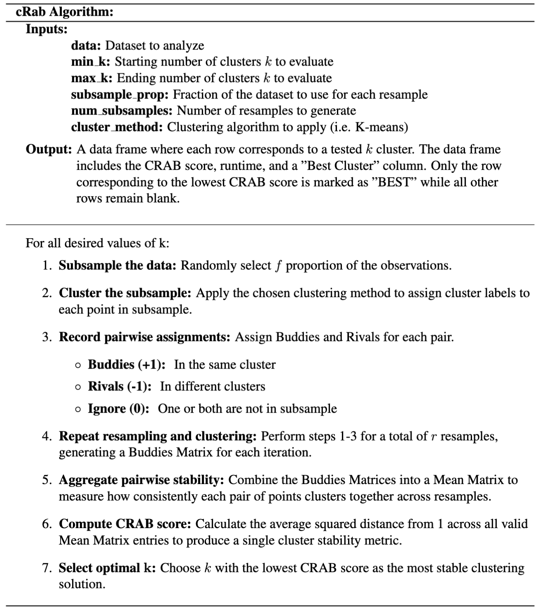
```

## Preparing the Data
Before applying the CRAB algorithm, ensure that the dataset is preprocessed appropriately
for the chosen clustering method. For example, if using K-means, this may include
handling missing values and standardizing features so that the variables on different
scales do not disproportionately influence the clustering algorithm.

The CRAB algorithm requires three main inputs:

- **Subsample Proportion ($f$):** Fraction of the dataset to use for each resample

- **Number of resamples ($r$):** Number of resamples to generate (i.e. number of 
times the data will be subsampled)

- **Range of $k$ values:** The different cluster counts to evaluate

For each resample, CRAB draws a random subset of the data containing $f$ proportion of the 
observations and applies the chosen clustering method (i.e. K-means) to assign cluster 
labels to each point. By repeating this process across multiple resamples, the algorithm 
detects which cluster assignments are consistently reproduced, instead of placing 
confidence on any single clustering of the full dataset.

## Buddies Matrix
After clustering each resample, CRAB constructs a Buddies Matrix, $B$, to track 
pairwise relationships between observations. This $n \times n$ matrix encodes whether 
points $i$ and $j$ were assigned to the same cluster:

$$
B_{i,j} =
\begin{cases}
1 , & \text{if they are in the same cluster} \\
-1 , & \text{if they are in different clusters} \\
0, & \text{if one or both points are not included in the subsample}
\end{cases}
$$

To reduce computation and take advantage of symmetry, CRAB sets the diagonal and lower 
triangle of each Buddies Matrix to NA. Each resample produces one Buddies Matrix, 
resulting in $r$ matrices in total. Collectively, these matrices capture how pairwise
relationships vary across resamples, forming the foundation for measuring cluster
stability. Ideally, each pair of observations ($i, j$) should consistently have
either 1s (always assigned to the same cluster) or -1s (always assigned to different
clusters) across resamples. Pairs that switch between 1 and -1 indicate instability
in the clustering assignments.

For example, Figure 2.1 shows a random sample from a mock dataset clustered using 
K-means. The five labeled points illustrate all possible scenarios: Observations 
1 and 3 belong in different clusters, while Observations 4 and 5 are in the same 
cluster. Observation 2, although part of the original dataset, was not included
in this particular sample.

```{r, out.width='80%', out.height='auto'}
#| label: Buddies Matrix Data 
#| echo: false # Use to hide code but not results
#| fig-cap: "Buddies Matrix Data"
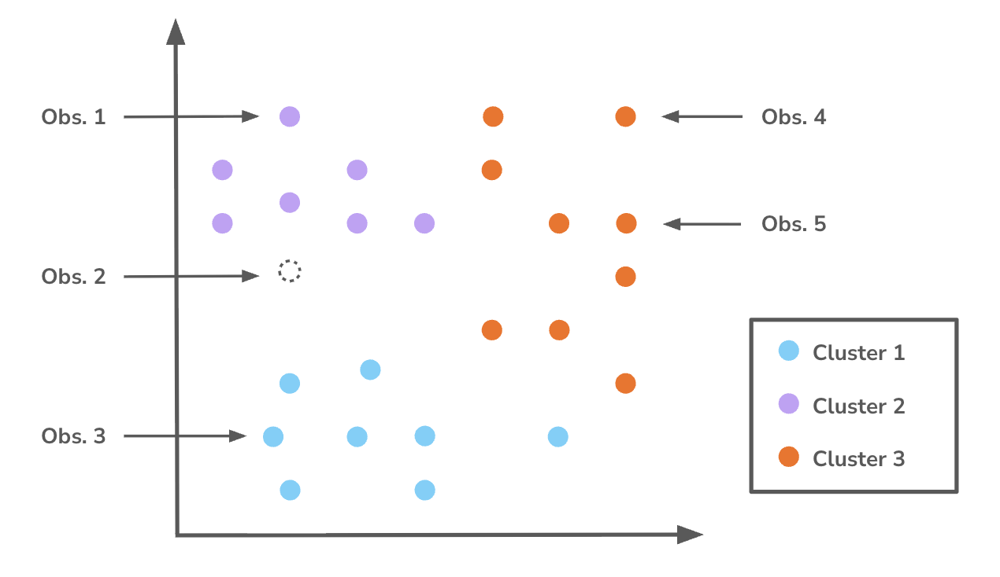
```

Figure 2.2 shows how these pairwise relationships are represented in a Buddies
Matrix.

```{r, out.width='65%', out.height='auto'}
#| label: Buddies Matrix Example 
#| echo: false # Use to hide code but not results
#| fig-cap: "Buddies Matrix Example"
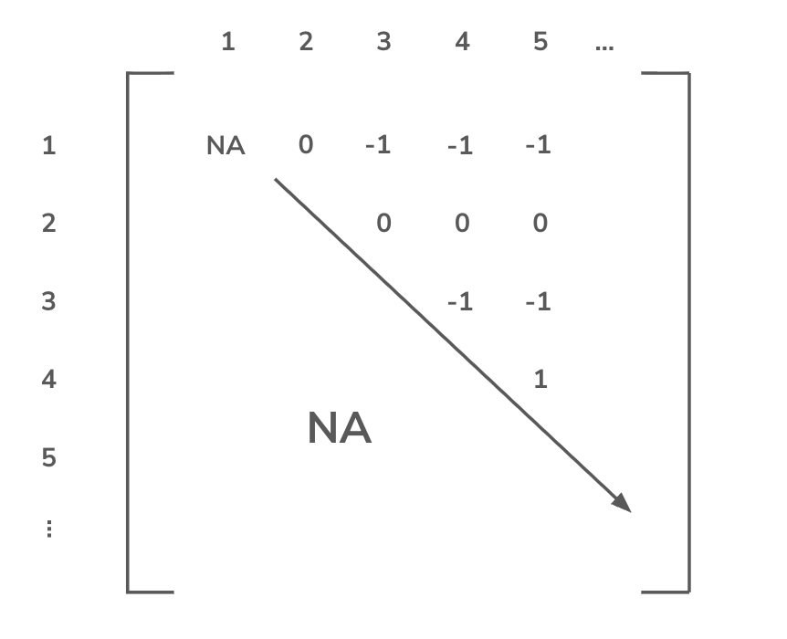
```


## Mean Matrix
The algorithm aggregates the Buddies Matrices to form the Mean Matrix, which summarizes 
the overall stability of pairwise cluster assignments. For each entry $(i,j)$, 
it first counts the number of resamples where both points were included. 
It then sums the corresponding entries from those Buddies Matrices and divides by 
the number of comparisons to obtain the mean. Each entry ranges from -1 and 1, 
reflecting how consistently the pair of points clusters together across resamples. 
Values closer to -1 suggest that the points are often placed in different clusters, 
while values closer to 1 indicate that the points are frequently assigned to the 
same cluster. Entries near 0 indicate inconsistent or ambiguous pairwise assignments. 
The Mean Matrix acts as a stability map, revealing which relationships remain robust
across different subsamples of the data. Figure 2.3 visually demonstrates how the
algorithm constructs the Mean Matrix from the Buddies Matrices.

```{r, out.width='100%', out.height='auto'}
#| label: Mean Matrix Example 
#| echo: false # Use to hide code but not results
#| fig-cap: "Mean Matrix Example"
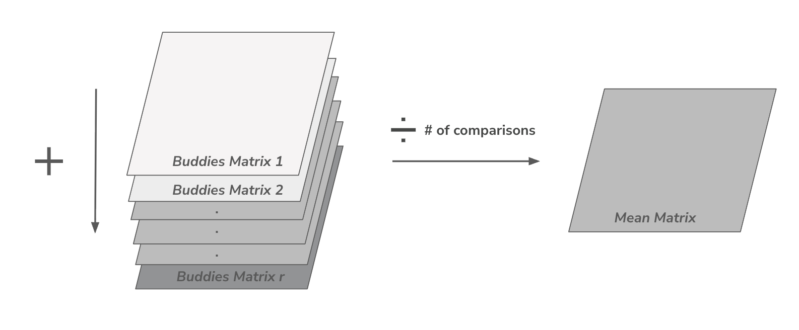
```


## Similarity Score
To summarize the information in the Mean Matrix, the CRAB score quantifies cluster
stability. Let $M$ represent the Mean Matrix with entries $M_{i,j}$ for each pair
of observations. The CRAB score is defined as:
$$
\text{CRAB Score} = \frac{1}{|V|}\sum_{(i,j)\in V}(1 - |M_{i,j}|)^2
$$
Where:

+ $V$ is the set of all valid entries in the vectorized Mean Matrix (i.e. all
pairs that are not NA)

+ $|V|$ is the number of valid entries

+ $M_{i,j}$ is the Mean Matrix entry for the $i, j$ pair

Scores close to 0 indicate that points consistently group together across all subsamples, 
suggesting highly reproducible clusters. In contrast, higher scores denote greater 
instability, signaling that cluster assignments vary significantly depending on the 
subsample. The CRAB score condenses these various pairwise relationships into a single 
metric that can be compared across different values of $k$.


## CRAB Performance
By computing the CRAB scores across different values of $k$, the algorithm identifies 
the most stable clustering as the one with the lowest score. This provides an 
objective criterion for selecting the number of clusters. In many cases, when
visualized across increasing $k$, the optimal value appears as a “pinching point” 
in the plot, where the score decreases before rising again for larger $k$ values. 

To illustrate the performance of CRAB, we use the well-known Palmer Penguins dataset [@palmerpenguins]
as an effective benchmark. This dataset is particularly useful because it 
contains a true class label, species, allowing for direct comparison between 
identified clusters and the actual groupings. There are three unique species along 
with several physical measurements, such as bill length, bill depth, and flipper 
length. For this analysis, we select flipper length and bill length, as these 
features provide strong separation between species with minimal overlap among observations.

```{r}
#| label: penguins data
#| echo: false # Use to hide code but not results
#| fig-cap: "Palmers Penguins Data"

# plot
palmerpenguins::penguins |>
  drop_na() |>
  ggplot(aes(x = bill_length_mm, y = flipper_length_mm, color = species)) +
  geom_point() +
  scale_color_manual(values = c("Adelie" = "#d35e7f",
                                "Chinstrap" = "#23395d",
                                "Gentoo" = "#a999eb")) +
  labs(x = "Bill Length (mm)",
       y = "",
       title = "Palmer Penguins Data",
       subtitle = "Flipper Length (mm) vs. Bill Length (mm)",
       color = "Species") +
  theme_bw() +
  theme(text = element_text(family = "serif"))
```

When applying the Elbow Method, the resulting plot in Figure 2.5 shows a gradual 
decrease in WCSS rather than a distinct bend. As discussed previously, this makes 
it difficult to clearly identify a clear optimal number of clusters, since there 
is no obvious point where the reduction in error slows significantly. As a result, 
the method provides little guidance and requires subjective interpretation.

```{r}
#| label: penguins elbow graph
#| echo: false # Use to hide code but not results
#| fig-cap: "Elbow Method on Palmers Penguins Data"
# set seed for recreation
set.seed(590)

penguins_scaled <- penguins |>
  dplyr::select(c(bill_length_mm, flipper_length_mm)) |>
  drop_na() |>
  scale() |>
  as.data.frame()

# grab x and y cols from data frame
X <- as.matrix(penguins_scaled[, c("bill_length_mm", "flipper_length_mm")])

# get wcss
wcss <- sapply(1:10, function(k) {
  kmeans(X, centers = k, nstart = 25)$tot.withinss})

# create data frame of wcss
elbow_dfp <- data.frame(
  k = 1:10,
  wcss = wcss)

# plot elbow method
elbow_dfp |>
  ggplot(aes(x = k, y = wcss)) +
  geom_point() +
  geom_line() +
  theme_bw() +
  labs(title = "Elbow Method Graph Using Total WCSS",
       subtitle = "On Palmers Penguins Data",
       x = "Number of Clusters (k)",
       y = NULL) +
  scale_x_continuous(breaks = 1:10) +
  theme(text = element_text(family = "serif"))
```

The Silhouette Score, shown in Figure 2.6, suggests that two clusters are optimal, 
as this value produces the highest average silhouette score. According to this metric, 
the data is best partitioned into two groups. However, this result conflicts with 
the known structure of the dataset, which contains three distinct species. This 
discrepancy highlights the method’s tendency to favor solutions that maximize 
separation.

```{r}
#| label: penguins ss graph
#| echo: false # Use to hide code but not results
#| fig-cap: "Silhouette Score on Palmers Penguins Data"

# set seed for recreation
set.seed(590)

# k vals
k_values <- 2:6

# intialize ss
sil_scores <- numeric(length(k_values))

# euclidean distance
d <- dist(penguins_scaled[, c("bill_length_mm", "flipper_length_mm")])

for (i in seq_along(k_values)) {
  k <- k_values[i]
  
  # run kmeans
  km <- kmeans(penguins_scaled[, c("bill_length_mm", "flipper_length_mm")], 
               centers = k, nstart = 25)
  
  # compute ss
  sil <- cluster::silhouette(km$cluster, d)
  
  # avg silhouette score
  sil_scores[i] <- mean(sil[, 3])}

# put results in dataframe
ss_results_p <- data.frame(k = k_values,
                      silhouette = sil_scores)

# plot
ss_results_p |>
  ggplot(aes(x = k, y = silhouette)) +
  geom_line() +
  geom_point() +
  theme_bw() +
  geom_text(aes(label = round(silhouette, 3)), 
            vjust = -0.9, hjust = 0.2,
            family = "serif") +
  ylim(0.39, 0.57) +
  xlim(2, 6.3) +
  labs(title = "Average Silhouette Score Across Number of Clusters",
       subtitle = "On Palmers Penguins",
       x = "Number of Clusters (k)",
       y = "") +
  theme(text = element_text(family = "serif"))
```

In contrast, the CRAB Score correctly identifies three clusters as the optimal 
solution with a score of 0.0048. The next lowest score occurs at $k$ = 2, which 
is consistent with the alternative methods. Although the “pinching point” appears
less visually pronounced in this example, the local minimum at $k$ = 3 provides a 
clear and objective indication of the suggested number of groupings. More importantly, 
this result aligns with the known structure of the dataset, as defined by the 
species label.

```{r}
#| include: false
peng_example <- read_csv(here::here("thesis draft folder", "csv", "peng_ex.csv"), na = character())
```

```{r, out.width='100%', out.height='auto'}
#| label: penguins crab table
#| echo: false # Use to hide code but not results
#| tbl-cap: "CRAB Performance on Palmers Penguins Table Line Graph"

library(kableExtra)

# table
peng_example |>
  kable()
```


```{r}
#| label: penguins crab graph
#| echo: false # Use to hide code but not results
#| fig-cap: "CRAB Performance on Palmers Penguins Data"

peng_example |>
  ggplot(aes(x = k, y = Score)) +
  geom_line() +
  geom_point() +
  labs(x = "Cluster Value (k)",
       y = "",
       title = "CRAB Score Across Cluster k Values") +
  theme_bw() +
  theme(text = element_text(family = "serif"))
  
```

Chapter 4 goes more into depth through a series of simulations that demonstrate 
CRAB's performance across various datasets, highlighting its ability to identify 
the true structure of the data. The chapter uses boxplots and other visualizations 
to illustrate how CRAB performs.


# The cRab Package in R

## Package Goal
After introducing the CRAB algorithm and outlining its step-by-step logic, we now 
turn to its practical implementation in R. The cRab package provides a reliable, automated 
framework for calculating the CRAB score, emphasizing a tidy and efficient workflow 
that aligns seamlessly with the tools and conventions R users already rely on. By 
formalizing this process into an accessible package, cRab offers a rigorous yet 
intuitive toolkit for validating cluster structures without the need for complex, 
or custom syntax.


## Design Philosophy and Ecosystem Integration
The cRab package extends the tidyclust ecosystem [@tidyclust] and builds on the core
principles of the tidymodels [@tidymodels] framework. Rather than being a standalone procedure,
the package treats clustering as an integrated step of a machine learning workflow. This architectural choice keeps the package familiar to modern data scientists by relying 
exclusively on standard R objects like tibbles and parsnip-style models. By adopting this “recipe” style, cRab fits directly into existing data pipelines without requiring users to 
learn new data formats.

The core logic of cRab uses the native R pipe (|>), which establishes a baseline 
requirement of R Version 4.1. While this introduces a specific version constraint, 
it prioritizes the long-term stability and readability of the codebase. By utilizing 
the native pipe, the package reduces external dependencies, such as the magrittr 
package [@magrittr] which houses the magrittr operator (%>%). As a result, the package
maintains a lighter installation footprint and produces more transparent error 
messages during debugging. Together, these design choices promote consistent and
easy to follow syntax as the R language continues to evolve.

## Functional Pipeline
The cRab package architecture leverages a workflow that preserves the original data
and builds a working object that updates as the analysis progresses. Unlike traditional 
R functions that return immediate transformations of data, cRab employs a system 
that structures the analysis into three logical phases: Initialization, Configuration, 
and Execution (Figure 3.1). 


```{r}
#| label: workflow diagram
#| echo: false # Use to hide code but not results
#| fig-cap: "cRab Package Workflow Diagram"

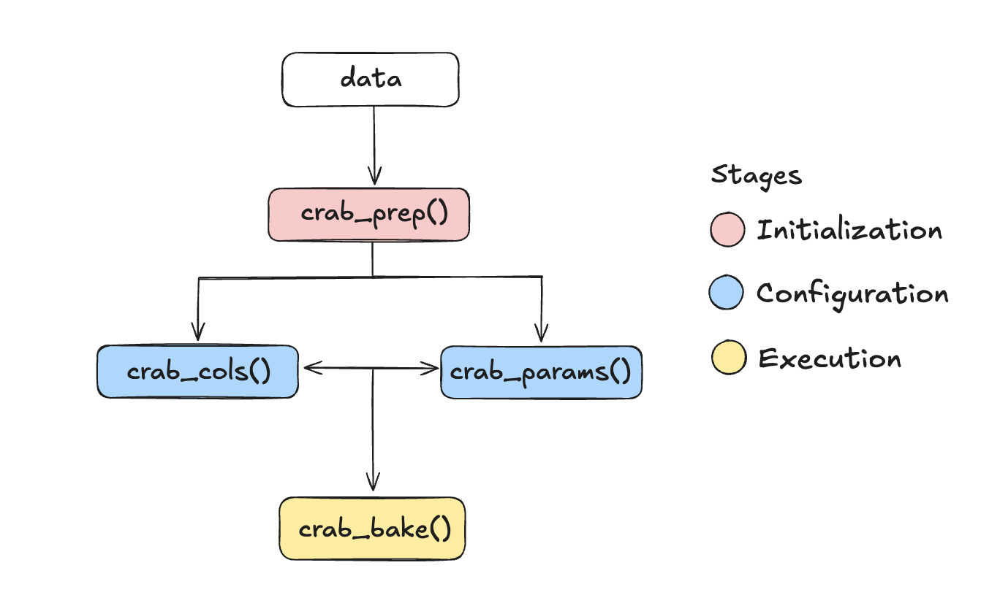
```

### Phase I: Initialization
The pipeline begins with the crab_prep object, which serves as the central container 
for the entire validation process. Upon initialization, the package 
generates a metadata-rich list that stores the raw data alongside a set of empty 
slots reserved for variable selection and hyperparameters. By storing information 
within this object, cRab facilitates a precomputation phase where it evaluates and 
records the structure of the data. This setup keeps later stages of the pipeline 
computationally efficient and consistent by avoiding repeated computation 
of the same information. To visualize the workflow setup, the iris dataset 
[@iris] will be used as an example.

```{r}
#| label: crab_prep example
#| echo: true 
#| eval: false
#| fig-cap: "crab_prep() Example"

iris |>
  crab_prep() 
```
```{r, out.width='90%', out.height='auto'}
#| label: crab_prep output
#| echo: false
#| fig-cap: "crab_prep() Example Output"
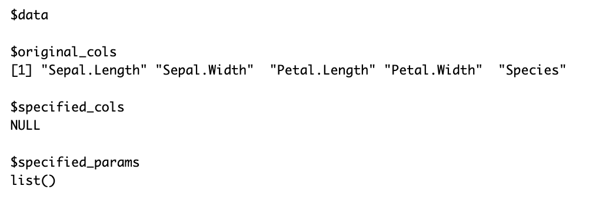
```


### Phase II: Configuration
After initialization, the workflow enters the Configuration Stage. To 
improve flexibility and readability, cRab splits configuration into two 
modular functions: crab_cols() and crab_params(). The first function, crab_cols(), 
manages variable selection, allowing the user to define which features contribute 
to distance metrics and clustering stability. It populates these choices in the 
specified_cols element within the crab_prep object (Figure 3.3).


```{r}
#| label: crab_cols example
#| echo: true 
#| eval: false
#| fig-cap: "crab_cols() Example"

iris |>
  crab_prep() |>
  crab_cols(c("Petal.Length", "Petal.Width"))
```
```{r, out.width='90%', out.height='auto'}
#| label: crab_cols output
#| echo: false 
#| fig-cap: "crab_cols() Example Output"
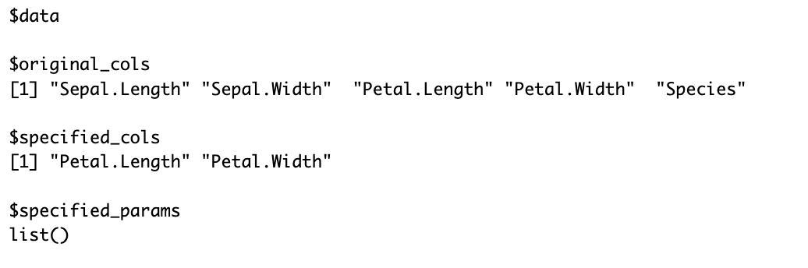
```

Complementing this, crab_params() defines the hyperparameters required for the 
Rivals and Buddies logic, including subsampling rates and number of iterations.
This step updates the specified_params slot (Figure 3.4).

```{r}
#| label: crab_params example
#| echo: true 
#| eval: false
#| fig-cap: "crab_params() Example"

iris |>
  crab_prep() |>
  crab_params(min_k = 3, max_k = 5, num_subsamples = 10,
              cluster_method = "kmeans")
```

```{r, out.width='90%', out.height='auto'}
#| label: crab_params output
#| echo: false
#| fig-cap: "crab_params() Example Output"
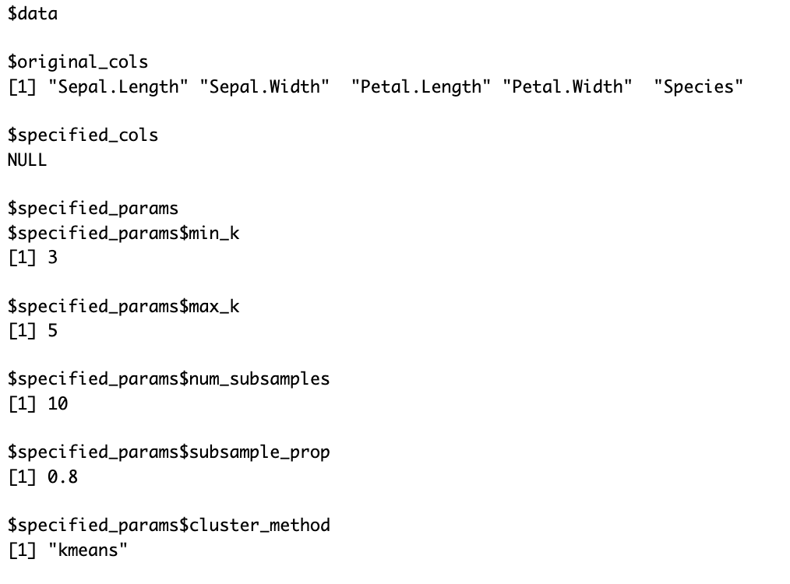
```

These two functions operate independently and can be input in any order. As a result, a researcher 
can call crab_cols() before or after crab_params(), and overwrite previous 
settings without affecting the underlying data. Each call made updates only its 
designated slot within the crab_prep object, keeping the workflow modular and 
transparent.

```{r}
#| label: configuration example
#| echo: true 
#| eval: false

# option 1
iris |>
  crab_prep() |>
  crab_cols(c("Petal.Length", "Petal.Width")) |>
  crab_params(min_k = 3, max_k = 5, num_subsamples = 10,
              cluster_method = "kmeans")

# option 2
iris |>
  crab_prep() |>
  crab_params(min_k = 3, max_k = 5, num_subsamples = 10,
              cluster_method = "kmeans") |>
  crab_cols(c("Petal.Length", "Petal.Width"))
```

```{r, out.width='90%', out.height='auto'}
#| label: configuration output
#| echo: false
#| fig-cap: "Configuration Stage Examples"

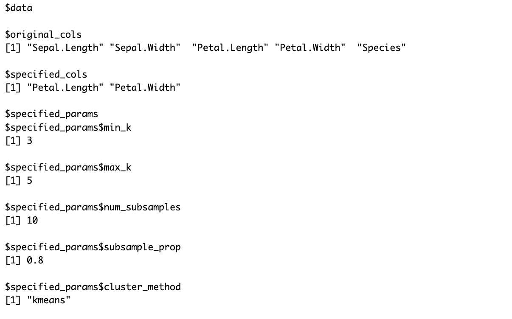
```

Before moving to the computationally intensive Execution phase, cRab implements a 
rigorous validation layer. Each function checks that the input object contains the 
required metadata and valid data types. The package also provides educational warnings 
to support correct usage. For instance, if a user sets $k = 1$, a scenario that is 
mathematically trivial for clustering stability, the package does not stop the execution
with an error. Instead, it issues a warning that $k=1$ does not produce meaningful
cluster results. This approach encourages more informed choices while maintaining 
workflow continuity.


### Phase III: Execution
The workflow transitions from specifications to results exclusively during the 
Execution Stage via crab_bake(). At this phase, the function reconciles the stored 
metadata and applies the configured logic to the raw data. It undoubtedly handles 
the heavy lifting by performing iterative subsampling and calculation of the final 
CRAB scores. These computations return a tidy data frame that summarizes cluster
stability in a clear and reproducible format.

```{r}
#| label: execution example
#| echo: true 
#| eval: false

iris |>
  crab_prep() |>
  crab_cols(c("Petal.Length", "Petal.Width")) |>
  crab_params(min_k = 3, max_k = 5, num_subsamples = 10,
              cluster_method = "kmeans") |>
  crab_bake()
```

```{r, out.width='90%', out.height='auto'}
#| include: false
iris_example <- read_csv(here::here("thesis draft folder", "csv", 
                                    "iris_ex.csv"), na = character())
```

```{r, out.width='90%', out.height='auto'}
#| label: execution output
#| echo: false
#| tbl-cap: "Execution Stage Example"

iris_example |>
  kable()
```


## Computational Strategy and Resource Management

The cRab pipeline relies on Buddies Matrices with an $n \times n$ structure, which
causes the computational cost of cluster validation to grow quadratically as the dataset
size increases. To maintain performance across different machines, the package maximizes
throughput through parallelism while limiting memory usage in its core data structures.

To accelerate the iterative Rivals and Buddies computations, cRab utilizes the doParallel [@doParallel]
and foreach [@foreach] libraries. Parallelization significantly reduces the total execution 
time by distributing iterations across multiple CPU cores, but consequently also
increases memory usage since each core requires a copy of the global environment.

To prevent system overload, the package applies a conservative core reservation
strategy by default:

$$
\text{Cores}_\text{Active} = \text{max}(1, \text{detectCores()}-5)
$$

By reserving several cores for background processes, the system remains responsive
during execution.

The primary computational bottleneck arises during the construction of the Buddies 
Matrix, which has a time and space complexity of $O(n^2)$, where $n$ represents 
the number of observations in each subsample. As $n$ increases, storing all pairwise
relationships can exceed available RAM and lead to memory errors.

To address this, cRab uses a more efficient storage strategy. The package reduces 
redundancy by storing only unique relationships. By utilizing the symmetry 
of the matrix and keeping only the upper triangle of indices, it effectively cuts
storage requirements roughly in half. Additionally, the package applies sparse 
indexing, tracking only relationships between observations present in each subsample.

These optimizations reduce memory demands and allow larger datasets to run on standard
hardware without sacrificing the accuracy of the CRAB score.


## Synthetic Data Generation

While cRab is designed to validate clusters in real-world datasets, controlled simulations
provide a way to evaluate its sensitivity when the true cluster structure is known. 
To support this, the package includes simulate_mvn(), a utility that allows users 
to benchmark the CRAB score on datasets with predefined cluster properties before 
applying the tool to ambiguous or unlabeled data.

The simulation framework uses Multivariate Normal (MVN) distributions from the MASS package [@mass] to offer precise control over cluster separation, orientation, and density. 
By manipulating the covariance structure, users can introduce varying levels of 
overlap and geometric distortion, creating a range of clustering scenarios.

The simulate_mvn() function generates data using three primary user inputs: the 
total number of observations ($n$), a variance scalar ($\sigma^2$), and the desired 
number of clusters ($k$). These parameters allow users to control how distinct or
overlapping the clusters appear.

```{r}
#| label: simulate_mvn() plot example
#| echo: false # Use to hide code but not results
#| fig-cap: "Synthetic Data Generated from simulate_mvn()"

data <- simulate_mvn(n = 150, variance = 0.2, desired_k = 3)

data |>
  ggplot(aes(x = X1, y = X2)) +
  geom_point() +
  labs(x = "X1",
       y = "",
       title = "Synthetic Data Generated from simulate_mvn()",
       subtitle = "Parameters: n = 150, variance = 0.2, desired number of clusters = 3") +
  theme_bw() +
  theme(text = element_text(family = "serif"))
```

For a single simulated dataset, the workflow follows the standard pipeline 
(Figure 3.7). In this scenario, simulate_mvn() generates the data, which then passes
through standard preprocessing and parameter specification layers before applying 
the CRAB algorithm.

```{r}
#| label: simulate_mvn() example
#| echo: false # Use to hide code but not results
#| fig-cap: "Singular Synthetic Dataset Generation with CRAB Algorithm Workflow"

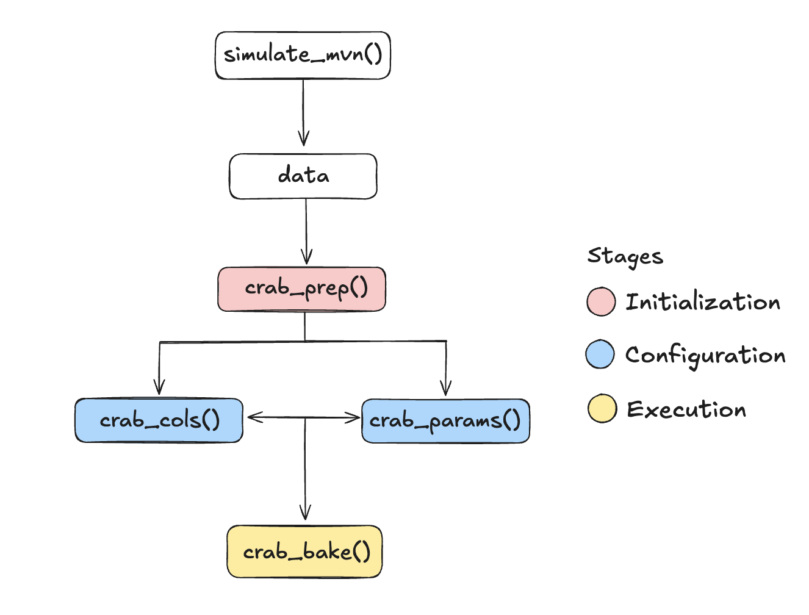
```


Below is an example code chunk:
```{r}
#| label: simulate_mvn() workflow example
#| echo: true # Use to hide code but not results
#| eval: false

# data from simulate_mvn()
data |>
  crab_prep() |>
  crab_cols(c("X1", "X2")) |>
  crab_params(min_k = 2, max_k = 5, num_subsamples = 10,
              cluster_method = "kmeans") |>
  crab_bake()
```

When evaluating performance across multiple runs or varying noise levels, the 
workflow shifts to a simulation focused approach (Figure 3.8). One option mirrors
the standard pipeline by initializing with crab_prep(NULL) and specifying generative
parameters through crab_sim_params(), such as the number of runs, variance, and 
sample size. The repeat_simulations() function then replaces crab_bake() and applies
the CRAB algorithm across multiple simulated datasets with consistent settings.
Alternatively, users can bypass the pipeline entirely and pass all parameters into
repeat_simulations() directly.

```{r}
#| label: repeat_simulations() workflow example
#| echo: false # Use to hide code but not results
#| fig-cap: "Multiple Synthetic Dataset Generation with CRAB Algorithm Workflow"

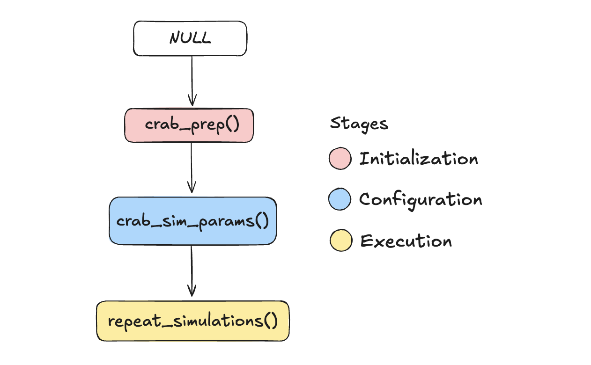
```

To illustrate these options, consider the following implementations:
```{r}
#| label: repeat_simulations() example
#| echo: true # Use to hide code but not results
#| eval: false

# option 1 -- pipeline format
crab_prep(data = NULL) |>
  crab_sim_params(min_k = 2, max_k = 5, num_subsamples = 10, 
                  num_runs = 2, variance = c(0.3, 0.4), 
                  cluster_method = "kmeans") |>
  repeat_simulations()

# option 2 -- directly passing in parameters
repeat_simulations(min_k = 2, max_k = 5, num_subsamples = 10, 
                   num_runs = 2, variance = c(0.3, 0.4), 
                   cluster_method = "kmeans")
```

Chapter 4 explores the results of these simulations in greater detail.

### Point Diagnostics

In addition to providing a global measure of cluster stability, the cRab framework  
includes diagnostic tools to identify which observations drive that stability or, 
more importantly, its instability. The point contribution() function allows for 
a granular, observation-level analysis by quantifying and visualizing how 
each individual data point impacts the final CRAB score.

In practice, raw instability values are difficult to interpret. Although they are
mathematically meaningful, their scale often varies across different datasets and 
dimensionalities, making visualization hard to read. To improve interpretability, 
point_contribution() applies a sigmoid transformation that maps contributions onto 
a bounded [0, 1] scale. This transformation standardizes the values and makes relative
differences easier to interpret.

```{r}
#| label: point_contribution() plot example
#| echo: false # Use to hide code but not results
#| fig-cap: "Point Contribution Example"
#| message: false

# contribution csv
contributions <- read_csv(here::here("thesis draft folder", 
                                     "csv", "point_contribution.csv"), 
                         na = character())

# df csv
df_scaled <- read_csv(here::here("thesis draft folder", "csv", "pc_df.csv"), 
                         na = character())

# plot data
ggplot(df_scaled, aes(x = x, y = y, 
                      color = contributions$singlePointContribution)) +
  scale_color_gradient(low = "darkblue", high = "red") +
  geom_point() +
  theme_bw() +
  labs(color = "Point Contribution Score") +
  theme(text = element_text(family = "serif"))
```

Observations that act as “swing voters” in the clustering structure are typically 
located near cluster boundaries, making them the most likely to switch cluster 
assignments across subsamples. Figure 3.9 illustrates this behavior where high 
contribution points appear as bright red regions concentrated near decision boundaries. 
In contrast, observations that don't change between clusters are labeled in a dark 
blue color and have a contribution score closer to 0. By isolating these observations, 
the function helps identify which data points disproportionately influence the CRAB 
score.


# Simulation Study

## Introduction

This study evaluates the performance and reliability of the CRAB 
algorithm under controlled conditions. Our primary goal is to establish a clear 
performance baseline by measuring how the CRAB score responds to changes in data 
structure and cluster complexity.

The analysis focuses on two distinct cluster geometries: spherical and non-spherical. 
For spherical clusters, we manipulate sample size ($n$), cluster variance, and the
number of clusters ($k$), whereas for non-spherical clusters, only the sample size 
and number of clusters are varied. Together, these dimensions allow us to evaluate 
how the CRAB score behaves across a range of conditions, from well separated and 
minimal noise settings to more ambiguous and complex scenarios.


## Experimental Setup

For spherical clusters, we generated data using the simulate_mvn() function which 
calls the MASS package. This function produces MVN distributions with 
user-specified variances, allowing precise control over cluster overlap.

Non-spherical clusters were created manually, one cluster at a time, also using 
functions from the MASS package. This method produces elongated or irregular cluster 
shapes, offering a more challenging test for the CRAB algorithm.

The simulation grid varies three primary variables:

+ **Sample Size ($n$):** $n \in \{102, 252, 402\}$ representing small, moderate and larger 
datasets. 

+ **Variance ($\sigma^2$):** $\sigma^2 \in \{0.2, 0.5, 0.8, 1\}$ controlling cluster compactness 
and overlap

+ **Number of Clusters ($k$):** $k \in \{2, 3, 4\}$ to evaluate performance across total 
cluster groupings. 

Each parameter combination isolates one factor at a time while holding the others 
fixed. This design ensures that changes in CRAB performance can be directly attributed
to the variable being tested.

Performance is evaluated based on the algorithm’s ability to correctly identify 
the true number of clusters. Strong results occur when the CRAB score reaches its 
global minimum at the correct value of $k$, indicating a clear and accurate detection 
of cluster structure. The shape of the score curve provides additional insight, 
as a clear “pinching point” suggests a well defined clustering solution.

To account for randomness, each scenario was repeated 25 times using the repeat_simulations() 
function. This produces a distribution of CRAB scores rather than a single outcome, 
allowing for a more reliable assessment of stability. Consistent results across 
runs indicate robust performance, while greater variability reflects sensitivity 
to noise or overlap.

## Spherical Data

To assess CRAB’s behavior on spherical clusters, we conducted experiments by 
systematically varying sample size, cluster variance, and the number of clusters. 
This setup allows us to observe how tightly grouped versus overlapping clusters 
influence the algorithm’s ability to detect the correct structure. 

Visualization and summary statistics from these simulations highlight trends in 
CRAB performance, showing how changes in cluster compactness and size affect score 
distributions and CRAB’s reliability.


### The Effect of Sample Size ($n$)

Sample size can significantly influence CRAB’s performance, affecting factors such 
as the proportion of the sample used and computation time. To evaluate its impact,
we tested CRAB on datasets with sample sizes of 102, 252, and 402, while keeping 
the number of clusters fixed at $k = 3$ and the variance at 0.5.

```{r, out.width='105%', out.height='auto'}
#| label: ssdata
#| message: false
#| echo: false
#| fig-cap: "Sample Size Datasets"

# load ss data
ss100df <- read_csv(here::here("thesis draft folder", "csv",
                           "simulations_updated", "ssdata_crab100.csv"), 
                          na = character())

ss250df <- read_csv(here::here("thesis draft folder", "csv",
                           "simulations_updated", "ssdata_crab250.csv"), 
                          na = character())

ss400df <- read_csv(here::here("thesis draft folder", "csv",
                           "simulations_updated", "ssdata_crab400.csv"), 
                          na = character())

# create source col for label
ss100df$source <- "102"
ss250df$source <- "252"
ss400df$source <- "402"

# create ss df
ss_all <- bind_rows(ss100df, ss250df, ss400df)

# plot with facet_wrap
ggplot(ss_all, aes(x = X1, y = X2)) +
  geom_point() +
  facet_wrap(~ source, nrow = 2, labeller = labeller(source = function(x) 
    paste("Sample Size =", x))) +
  theme_bw() +
  labs(title = "Spherical Clusters by Sample Size",
       x = "X1",
       y = "") +
  theme(text = element_text(family = "serif"))
```

```{r, out.width='105%', out.height='auto'}
#| label: ss100
#| message: false
#| echo: false
#| fig-cap: "CRAB Score Across Sample Size"

# load ss data
ss100 <- read_csv(here::here("thesis draft folder", "csv",
                           "simulations_updated", "ss_crab100.csv"), 
                          na = character())

ss100_mult <- read_csv(here::here("thesis draft folder", "csv",
                           "simulations_updated", "ss100_crab_mult.csv"), 
                          na = character())

ss250 <- read_csv(here::here("thesis draft folder", "csv",
                           "simulations_updated", "ss_crab250.csv"), 
                          na = character())

ss250_mult <- read_csv(here::here("thesis draft folder", "csv",
                           "simulations_updated", "ss250_crab_mult.csv"), 
                          na = character())

ss400 <- read_csv(here::here("thesis draft folder", "csv",
                           "simulations_updated", "ss_crab400.csv"), 
                          na = character())

ss400_mult <- read_csv(here::here("thesis draft folder", "csv",
                           "simulations_updated", "ss400_crab_mult.csv"), 
                          na = character())

# add source col for labels
ss100_mult$source <- "102"
ss250_mult$source <- "252"
ss400_mult$source <- "402"

# create ss df
ss_multall <- bind_rows(ss100_mult, ss250_mult, ss400_mult)

# plot with facet_wrap
ggplot(ss_multall, aes(x = factor(k), y = Score)) +
  geom_boxplot(fill = "pink") +
  facet_wrap(~ source, nrow = 2, labeller = labeller(source = function(x) 
    paste("Sample Size =", x))) +
  theme_bw() +
  labs(title = "CRAB Score by Sample Size",
       x = "k",
       y = "") +
  theme(text = element_text(family = "serif"))

```
Figure 4.1 illustrates that as the sample size increases, the clusters become more 
densely packed, making the groupings easier to discern visually. 

Despite these differences in sample size, CRAB consistently identifies the correct 
number of clusters. In all cases, $k = 3$ achieves the lowest CRAB score (Figure 4.2), 
demonstrating the algorithm’s robustness across varying dataset sizes.

### The Effect of Variance ($\sigma^2$)

To examine how cluster overlap affects CRAB’s performance, we generated spherical 
clusters using the MVN distribution across variances 0.2, 0.5, 0.8, and 1. With MVN
distributions, smaller variances produce tightly packed, and well separated clusters, 
while larger variances create more dispersed clusters with significant overlap.

For each scenario, $k = 3$ remains the true cluster structure, and the total sample size is set to 252 observations to ensure an equal number of points per cluster. 

```{r, out.width='105%', out.height='auto'}
#| label: variance example
#| message: false
#| echo: false
#| fig-cap: "Spherical Clusters by Variance"

# load var data
var_1 <- read_csv(here::here("thesis draft folder", "csv",
                           "simulations_updated", "var_crab_data1.csv"), 
                          na = character())

var_2 <- read_csv(here::here("thesis draft folder", "csv",
                           "simulations_updated", "var_crab_data2.csv"), 
                          na = character())

var_5 <- read_csv(here::here("thesis draft folder", "csv",
                           "simulations_updated", "var_crab_data5.csv"), 
                          na = character())

var_8 <- read_csv(here::here("thesis draft folder", "csv",
                           "simulations_updated", "var_crab_data8.csv"), 
                          na = character())

# add var col for label
var_1$var <- "1"
var_2$var <- "0.2"
var_5$var <- "0.5"
var_8$var <- "0.8"

# create var df
var_all <- bind_rows(var_1, var_2, var_5, var_8)

# plot with facet_wrap
ggplot(var_all, aes(x = X1, y = X2)) +
  geom_point() +
  facet_wrap(~ var, nrow = 2, labeller = labeller(var = function(x) 
    paste("Variance =", x))) +
  theme_bw() +
  labs(title = "Spherical Clusters by Variance",
       x = "X1",
       y = "") +
  theme(text = element_text(family = "serif"))
```
Figure 4.3 presents four side by side scatterplots, each corresponding to a different 
variance (0.2, 0.5, 0.8, 1), illustrating how cluster spread affects visual separability. 
At lower variances, the clusters are clearly distinct and easily identifiable, but 
as variance increases, the boundaries become less defined, making it more challenging 
to discern the underlying structure by eye. 

```{r, out.width='105%', out.height='auto'}
#| label: effect of var boxplots
#| echo: false # Use to hide code but not results
#| message: false
#| fig-cap: "Multiple Seeds Testing CRAB Score Across Variance"

# load var data
var_crab_mult <- read_csv(here::here("thesis draft folder", "csv",
                           "simulations_updated", "var_crab_mult.csv"), 
                          na = character())

# plot
var_crab_mult |>
  ggplot(aes(x = factor(k), y = Score)) +
  geom_boxplot(fill = "pink") +
  facet_wrap(~var) +
  labs(title = "Multiple Seeds Testing CRAB Score Across Variance", 
       y = "",
       x = "k") +
  theme_bw() +
  theme(text = element_text(family = "serif"))
```

```{r}
#| label: effect of var
#| echo: false # Use to hide code but not results
#| message: false
#| tbl-cap: "Win Proportion for Each k Across Different Variances"

# load var data
var_crab_mult <- read_csv(here::here("thesis draft folder", "csv",
                           "simulations_updated", "var_crab_mult.csv"), 
                          na = character())

# plot
var_crab_mult |>
  group_by(var, k) |>
  summarize(total_wins = sum(`Best Cluster (k)` == "BEST")) |>
  mutate(`Win Proportion` = paste0((total_wins/25) * 100, "%")) |>
  dplyr::select(-total_wins) |>
  pivot_wider(names_from = k,
              values_from = `Win Proportion`,
              values_fill = "0") |>
  rename(`k = 2` = `2`,
         `k = 3` = `3`,
         `k = 4` = `4`,
         `k = 5` = `5`,
         "Variance" = var) |>
  kable(align = rep("r")) |>
  row_spec(0, bold = TRUE) |>
  footnote(general = "Proportions use 25 runs per variance.") 

```

Across 25 runs, CRAB correctly identified $k = 3$ in all runs 
for the lower variances of 0.2 and 0.5, achieving a perfect success rate. As the 
variance increased, the algorithm continued to identify the correct number of 
clusters in the majority of runs. At variance 0.8, CRAB predicted $k = 3$ in 92 percent
of runs and $k = 2$ in 8 percent. Similarly, while at variance 1, it predicted $k = 3$
in 88 percent of runs and $k = 2$ in 12 percent (Table 4.1).

These results demonstrate that CRAB reliably recovers the correct number of groupings 
under low to moderate overlap. Even as cluster separation decreases with higher 
variance, the algorithm remains largely robust, though prediction certainty declines 
slightly.

### The Effect of Number of Clusters ($k$)

For this simulation, we evaluated whether the CRAB algorithm can correctly
identify the true underlying structure when the correct number of groupings changes. While $k = 3$ provides a useful baseline, 
it is important that CRAB accurately captures the correct $k$ across multiple 
scenarios. Here, we test CRAB's performance for $k = 2$, $k = 3$, and $k = 4$.

For each scenario, we set the variance to 0.5, and similar to the simulations in
Section 4.3.2, we adjusted the total sample size to 252 observations 
are equally split among each of the tested cluster groupings.

Each test $k$ value is represented by two types of plots:

1. **"Individual Seeds" Plot:** Three separate runs of the CRAB algorithm

2. **"Multiple Seeds" Plot:** Side by side boxplots summarizing results from 25 
runs for each $k$ value

The individual seeds plot reveals cases where a particular $k$ value may emerge as 
optimal, which might be less apparent in the aggregated boxplots. The three 
individual runs correspond to the first three seeds used in the multiple seeds 
plot.


```{r, out.width='103%', out.height='auto'}
#| label: effect of k, k = 2
#| echo: false # Use to hide code but not results
#| message: false
#| fig-cap: "CRAB Scores for Individual and Multiple Seeds When k = 2"

# format side by side
par(mfrow = c(1, 2))

# load individual k = 2 csv
k2 <- read_csv(here::here("thesis draft folder", "csv",
                           "simulations_updated", "k_crab2.csv"), 
               na = character())
k2_2 <- read_csv(here::here("thesis draft folder", "csv",
                           "simulations_updated", "k_crab2_2.csv"),
                 na = character())
k2_3 <- read_csv(here::here("thesis draft folder", "csv",
                           "simulations_updated", "k_crab2_3.csv"), 
                 na = character())

# add source column
k2$source <- "df1"
k2_2$source <- "df2"
k2_3$source <- "df3"

# combine to create k=2 df
k2_df <- bind_rows(k2, k2_2, k2_3)


# load multiple k = 2 csv
k2_mult <- read_csv(here::here("thesis draft folder", "csv",
                           "simulations_updated", "k_crab_mult2.csv"), 
                    na = character())


# get plots on same scale
score_range <- range(c(k2_df$Score, k2_mult$Score), 
                     na.rm = TRUE)

# individual runs k = 2
p1 <- k2_df |>
ggplot(aes(x = k, y = Score, color = source)) +
  geom_line() +
  geom_point() +
  labs(color = "",
       y = "") +
  scale_color_brewer(palette = "Set2") +
  theme_bw() +
  theme(legend.position = "none",
        text = element_text(family = "serif")) + 
  ylim(score_range)

# multiple runs k = 2
p2 <- k2_mult |>
  ggplot(aes(x = factor(k), y = Score)) +
  geom_boxplot(fill = "pink") +
  labs(y = "",
       x = "k") +
  ylim(score_range) +
  theme_bw() +
  theme(text = element_text(family = "serif"))

# output side by side
p1 + p2 
```


```{r}
#| echo: false
#| tbl-cap: "Cluster k Win Proportion When k = 2"
k2_mult |>
  group_by(run) |>
  slice_min(Score, n = 1, with_ties = FALSE) |>
  ungroup() |>
  count(k) |>
  complete(k = 2:5, fill = list(n = 0)) |>
  mutate(`Win Proportion` = paste0(round((n / sum(n)) * 100, 
                                         1), "%")) |>
  rename(`Number of Wins` = n) |>
  kable(align = rep("r")) |>
  row_spec(0, bold = TRUE) |>
  footnote(general = "Proportions use 25 runs per variance.") 
```

Examining the individual runs for $k = 2$, two out of three seeds (purple and 
orange lines) indicate $k = 4$ as the optimal number of clusters (Figure 4.5). 
In particular, the purple line shows a strong preference for $k = 4$, while the 
orange line produces very similar CRAB scores for $k = 2$ and $k = 4$. The green 
line, on the other hand, distinctly favors $k = 2$ over $k = 3, 4,  \text{and} \ 5$.

The multiple seeds plot in Figure 4.5 highlights that CRAB scores for $k = 2$ are 
more variable, whereas scores for $k = 4$ remain consistently close to zero. This 
higher variability for $k = 2$ reflects plausible alternative cluster structures 
rather than indicating an error, since clusters of two can naturally subdivide.

Across all 25 runs, the algorithm selects $k = 4$ most frequently, winning 60 
percent of the time, while $k = 2$ accounts for the remaining 40 percent (Table 4.2). 
The algorithm never selects any of the other tested $k$ values as the most optimal.

```{r, out.width='103%', out.height='auto'}
#| label: effect of k, k = 3
#| echo: false # Use to hide code but not results
#| message: false
#| fig-cap: "CRAB Scores for Individual and Multiple Seeds When k = 3"

# load individual k=3 csv
k3 <- read_csv(here::here("thesis draft folder", "csv",
                           "simulations_updated", "k_crab3.csv"), na = character())
k3_2 <- read_csv(here::here("thesis draft folder", "csv",
                           "simulations_updated", "k_crab3_2.csv"), na = character())
k3_3 <- read_csv(here::here("thesis draft folder", "csv",
                           "simulations_updated", "k_crab3_3.csv"), na = character())

# add source column
k3$source <- "df1"
k3_2$source <- "df2"
k3_3$source <- "df3"

# combine to create k=3 df
k3_df <- bind_rows(k3, k3_2, k3_3)


# load multiple k=3 csv
k3_mult <- read_csv(here::here("thesis draft folder", "csv",
                           "simulations_updated", "k_crab_mult3.csv"), na = character())


# get plots on same scale
score_range <- range(c(k3_df$Score, k3_mult$Score), 
                     na.rm = TRUE)

# individual runs k = 3
p1 <- k3_df |>
ggplot(aes(x = k, y = Score, color = source)) +
  geom_line() +
  geom_point() +
  labs(color = "",
       y = "") +
  scale_color_brewer(palette = "Set2") +
  theme_bw() +
  theme(legend.position = "none") + 
  ylim(score_range)

# multiple runs k = 3
p2 <- k3_mult |>
  ggplot(aes(x = factor(k), y = Score)) +
  geom_boxplot(fill = "pink") +
  labs(y = "",
       x = "k") +
  ylim(score_range) +
  theme_bw() +
  theme(text = element_text(family = "serif"))

# output side by side
p1 + p2 
```

When $k = 3$, the individual seeds consistently point to three clusters as the 
winner using the global minimum of the CRAB scores (Figure 4.6). Across the 25 
runs, CRAB scores for $k = 3$  show the smallest range and are the closest to zero
compared to the other $k$ values, suggesting a strong preference for this number 
of clusters. In this case, the algorithm successfully identifies the underlying 
structure, and the result is reinforced by a clear pinching point, where the CRAB 
score dips sharply at $k = 3$ before rising for higher $k$ values.


```{r, out.width='103%', out.height='auto'}
#| label: effect of k, k = 4
#| echo: false # Use to hide code but not results
#| message: false
#| fig-cap: "CRAB Scores for Individual and Multiple Seeds When k = 4"

# load individual k=4 csv
k4 <- read_csv(here::here("thesis draft folder", "csv",
                           "simulations_updated", "k_crab4.csv"), 
               na = character())
k4_2 <- read_csv(here::here("thesis draft folder", "csv",
                           "simulations_updated", "k_crab4_2.csv"), 
                 na = character())
k4_3 <- read_csv(here::here("thesis draft folder", "csv",
                           "simulations_updated", "k_crab4_3.csv"),
                 na = character())

# add source column
k4$source <- "df1"
k4_2$source <- "df2"
k4_3$source <- "df3"

# combine to create k=4 df
k4_df <- bind_rows(k4, k4_2, k4_3)


# load multiple k=4 csv
k4_mult <- read_csv(here::here("thesis draft folder", "csv",
                           "simulations_updated", "k_crab_mult4.csv"), 
                    na = character())


# get plots on same scale
score_range <- range(c(k4_df$Score, k4_mult$Score), 
                     na.rm = TRUE)

# individual runs k = 4
p1 <- k4_df |>
ggplot(aes(x = k, y = Score, color = source)) +
  geom_line() +
  geom_point() +
  labs(color = "",
       y = "") +
  scale_color_brewer(palette = "Set2") +
  theme_bw() +
  theme(legend.position = "none",
        text = element_text(family = "serif")) + 
  ylim(score_range)

# multiple runs k = 4
p2 <- k4_mult |>
  ggplot(aes(x = factor(k), y = Score)) +
  geom_boxplot(fill = "pink") +
  labs(y = "",
       x = "k") +
  ylim(score_range) + 
  theme_bw() +
  theme(text = element_text(family = "serif"))

# output side by side
p1 + p2 
```

Testing $k = 4$ produces a similar pattern. The algorithm identifies four clusters 
as the best choice (Figure 4.7), with CRAB scores again concentrated near zero and 
a distinct pinching point at $k = 4$. Although the boxplots show that $k = 3$ and $k = 5$ 
exhibit relatively small ranges, neither reach the low scores observed for $k = 4$.

Overall, CRAB consistently identifies the correct number of clusters across different
$k$ values. For $k = 3$ and $k = 4$, the algorithm reliably selects the true cluster
count, with CRAB scores concentrated near the global minimum and distinct pinching
points. CRAB scores varied for $k = 2$, suggesting four clusters in the majority 
of runs, suggesting plausible alternative subdivisions of the data. These results 
confirm that CRAB accurately recovers the underlying clustering configuration and 
maintains stability across repeated runs.

Across all examined factors, including sample size, variance, and the number of clusters,
CRAB demonstrates robust and reliable performance on spherical data. The algorithm
consistently identifies the correct number of clusters under low to moderate overlap. 
Even as cluster separation decreases with higher variance or
as larger sample sizes increases cluster density, its accuracy is maintained.


## Non-Spherical Data

To evaluate CRAB's performance on non-spherical clusters, we generated elongated
and irregular cluster shapes while varying sample size and the number of clusters.
Variance was not systematically tested, as each cluster naturally exhibits its
own spread in these non-spherical configurations. This approach allows us to 
examine how deviations from spherical geometry affect the algorithm's ability to 
identify cluster structure.

### Effect of Sample Size

For non-spherical clusters, sample size can influence how well CRAB captures the 
underlying structure given the irregular and elongated shapes of the clusters. 
We examined datasets with 102, 252 and 402 observations, keeping the correct number of 
clusters fixed at 3. To ensure balanced comparisons, we distributed the observations 
evenly across clusters in each scenario, providing a consistent basis for evaluating 
CRAB’s performance.


```{r}
#| label: effect of ss for ns data, ss = 102
#| echo: false # Use to hide code but not results
#| message: false
#| fig-cap: "CRAB Scores for Non-Spherical Data with Sample Size = 102"

# load data
ss100_ns <- read_csv(here::here("thesis draft folder", "csv",
                           "ns_simulations", "ss100_ns.csv"), 
                 na = character())

ss100data_ns <- read_csv(here::here("thesis draft folder", "csv",
                           "ns_simulations", "ss100data_ns.csv"), 
                 na = character())

# plot
p1 <- ss100data_ns |>
  ggplot(aes(x = X1, y = X2,
             color = cluster)) +
  geom_point() +
  labs(y = "") +
  theme_bw() +
  theme(legend.position = "none",
        text = element_text(family = "serif"))

p2 <- ss100_ns |>
  ggplot(aes(x = k, y = Score)) +
  geom_point() +
  geom_line() +
  theme_bw() +
  labs(y = "") +
  theme(text = element_text(family = "serif"))

p1 + p2
```

With a sample size of 102, each of the three clusters contains only 34 observations. 
Despite the relatively small number of points per cluster, the CRAB algorithm 
successfully identified the correct number of clusters (Figure 4.8). The resulting 
CRAB score plot exhibits a clear pinching point at the true solution, confirming 
that $k = 3$ represents the optimal clustering configuration. 

```{r}
#| label: effect of ss for ns data, ss = 252
#| echo: false # Use to hide code but not results
#| message: false
#| fig-cap: "CRAB Scores for Non-Spherical Data with Sample Size = 252"

# load data
ss250_ns <- read_csv(here::here("thesis draft folder", "csv",
                           "ns_simulations", "ss250_ns.csv"), 
                 na = character())

ss250data_ns <- read_csv(here::here("thesis draft folder", "csv",
                           "ns_simulations", "ss250data_ns.csv"), 
                 na = character())

# plot
p1 <- ss250data_ns |>
  ggplot(aes(x = X1, y = X2,
             color = cluster)) +
  geom_point() +
  scale_color_manual(values = c("#f8766d", "#00ba38", "#619cff")) + 
  theme_bw() +
  labs(y = "") +
  theme(legend.position = "none",
        text = element_text(family = "serif"))

p2 <- ss250_ns |>
  ggplot(aes(x = k, y = Score)) +
  geom_point() +
  geom_line() +
  theme_bw() +
  labs(y = "") +
  theme(text = element_text(family = "serif"))

 p1 + p2
```

Increasing the total sample size to 252, however, alters the outcome. In this scenario, 
CRAB identifies $k = 2$ as the best solution, narrowly outperforming $k = 3$ in 
terms of the lowest score (Figure 4.9).

To investigate this behavior, we applied the point_contribution() function. Points 
highlighted in bright red indicate the largest contributions to the CRAB score and, 
therefore, have the greatest influence on the algorithm’s evaluation.

The point contribution scatterplot for $k = 2$ (Figure 4.10) reveals several high
contribution points near (-1, 0.5) to (0.05) and around (1.5, -0.8). These points 
align with the boundaries determined by K-means when clustering the data into two 
centroids, suggesting that the assignment of points by K-means is a driving factor.

```{r}
#| label: analysis of ss for ns data, ss = 252
#| echo: false # Use to hide code but not results
#| message: false
#| fig-cap: "Point Contribution Scores for Sample Size = 252 with k = 2"

# load data
ss250 <- read_csv(here::here("thesis draft folder", "csv",
                           "ns_simulations", "ns250data.csv"), 
                 na = character())

# point contributions
ss250pc2 <- read_csv(here::here("thesis draft folder", "csv",
                           "ns_simulations", "k2_250pc.csv"), 
                 na = character())

km2 <- kmeans(ss250, centers = 2, nstart = 25)


# format
par(mfrow=c(1,2))

# plots
p1 <- ss250 |>
ggplot(aes(x = X1, y = X2, 
           color = ss250pc2$singlePointContribution)) +
  scale_color_gradient(low = "darkblue", high = "red") +
  geom_point() +
  theme_bw() +
  theme(legend.position = "top",
        text = element_text(family = "serif")) +
  labs(color = "Point Contribution",
       y = "")

p2 <- ggplot(ss250) +
  geom_point(aes(x = X1, 
                 y = X2, 
                 color = factor(km2$cluster))) +
  geom_point(data = data.frame(km2$centers), 
             aes(x = X1, y = X2), size = 2) +
  scale_color_manual(values = c("lightblue", "#D81B60"),
                     guide = guide_legend(title = "Cluster Assignment",
                                          title.position = "top",  
                                          title.hjust = 0.5,        
                                          label.position = "top",   
                                          nrow = 1)) + 
  theme_bw() +
  theme(legend.position = "top",
        text = element_text(family = "serif")) +
  labs(color = "Cluster Assignment",
       y = "")

p1 + p2
```

A similar pattern emerges in the $k = 3$ scenario (Figure 4.11). While the bottom 
right cluster contains points with minimal contribution to the CRAB score, the top 
two clusters include slightly higher contributing points, with the brightest points 
matching the K-means cluster boundaries.

```{r}
#| label: analysis of ss for ns data, ss = 252 p2
#| echo: false # Use to hide code but not results
#| message: false
#| fig-cap: "Point Contribution Scores for Sample Size = 252 with k = 3"

# data
ss250pc3 <- read_csv(here::here("thesis draft folder", "csv",
                           "ns_simulations", "k3_250pc.csv"), 
                 na = character())

# km assignments
km3 <- kmeans(ss250, centers = 3, nstart = 25)

par(mfrow = c(1, 2))
p3 <- ss250 |>
ggplot(aes(x = X1, y = X2, 
           color = ss250pc3$singlePointContribution)) +
  scale_color_gradient(low = "darkblue", high = "red") +
  geom_point() +
  theme_bw() +
  theme(legend.position = "top",
        text = element_text(family = "serif")) +
  labs(color = "Point Contribution",
       y = "")

p4 <- ggplot(ss250) +
  geom_point(aes(x = X1, 
                 y = X2, 
                 color = factor(km3$cluster))) +
  geom_point(data = data.frame(km3$centers), 
             aes(x = X1, y = X2), size = 2) +
  scale_color_manual(values = c("orange", "lightblue", "#D81B60"),
    guide = guide_legend(title = "Cluster Assignment",
                         title.position = "top",  
                         title.hjust = 0.5,        
                         label.position = "top",   
                         nrow = 1)) + 
  theme_bw() +
  theme(legend.position = "top",
        text = element_text(family = "serif"),
        legend.direction = "horizontal") +
  labs(color = "Cluster Assignment",
       y = "")

p3 + p4
```

These observations indicate that the deviation in CRAB’s selection may not reflect
a limitation of the algorithm itself but rather the influence of the K-means cluster assignments used in the implementation.


```{r}
#| label: effect of ss for ns data, ss = 402
#| echo: false # Use to hide code but not results
#| message: false
#| fig-cap: "CRAB Scores for Non-Spherical Data with Sample Size = 402"

# load data
ss400_ns <- read_csv(here::here("thesis draft folder", "csv",
                           "ns_simulations", "ss400_ns.csv"), 
                 na = character())

ss400data_ns <- read_csv(here::here("thesis draft folder", "csv",
                           "ns_simulations", "ss400data_ns.csv"), 
                 na = character())

# plot
p1 <- ss400data_ns |>
  ggplot(aes(x = X1, y = X2,
             color = cluster)) +
  geom_point() +
  theme_bw() +
  labs(y = "") +
  theme(legend.position = "none",
        text = element_text(family = "serif"))

# plot
p2 <- ss400_ns |>
  ggplot(aes(x = k, y = Score)) +
  geom_point() +
  geom_line() +
  theme_bw() +
  labs(y = "") +
  theme(text = element_text(family = "serif"))

p1 + p2
```
When the sample size is increased to 402, the CRAB algorithm successfully detects
the correct number of groupings. The CRAB score plot displays a pinching point at 
$k = 3$, illustrating that the algorithm can recover the true cluster structure 
when more observations are available, even for irregular and elongated cluster 
shapes.

Overall, for non-spherical clusters, CRAB reliably determines the true number of clusters
when the sample size is small (102 observations) or large (402 observations), as 
indicated by clear pinching points and global minimums at $k = 3$. Intermediate
sample sizes can lead to temporary deviations, where high contribution points influence the score and slightly shift the optimal $k$, potentially due to K-means cluster assignments.
Increasing the number of observations enhances CRAB's stability and accuracy in capturing 
irregular cluster structures.

### Effect of Cluster 

To evaluate the effect of the number of clusters on non-spherical data, we placed 
the initial clusters in consistent locations, adding additional
clusters incrementally when called for (Figure 4.13). For example, the $k = 2$ example contains 
two clusters. In the $k = 3$ scenario, the two clusters that were present in the $k = 2$ simulation are kept and a third cluster is introduced. The original two clusters are slightly adjusted to maintain a fixed total 
of 252 observations. Since we could not vary cluster placement or shape extensively,
we increased the number of resamples to 60 and set the sample proportion to 0.90 to 
ensure a more robust assessment. Unlike the spherical simulations, we did not fix 
variance, allowing each elongated cluster to retain its natural variability, which 
provides a more realistic and challenging test for CRAB. 


```{r, out.width='105%', out.height='auto'}
#| label: effect of cluster for ns data
#| echo: false # Use to hide code but not results
#| message: false
#| fig-cap: "Non-Spherical Data With Different k Values"

# load data
k2_datans <- read_csv(here::here("thesis draft folder", "csv",
                           "ns_simulations", "k_crab2_datans.csv"), 
                 na = character())

k3_datans <- read_csv(here::here("thesis draft folder", "csv",
                           "ns_simulations", "k_crab3_datans.csv"), 
                 na = character())

k4_datans <- read_csv(here::here("thesis draft folder", "csv",
                           "ns_simulations", "k_crab4_datans.csv"), 
                 na = character())

par(mfrow = c(2, 2))

p1 <- k2_datans |>
  ggplot(aes(x = X1, y = X2)) +
  geom_point() +
  theme_bw() +
  labs(y = "",
       x = "k",
       title = "True k = 2") +
  theme(text = element_text(family = "serif"))

p2 <- k3_datans |>
  ggplot(aes(x = X1, y = X2)) +
  geom_point() +
  theme_bw() +
  labs(y = "",
       x = "k",
       title = "True k = 3") +
  theme(text = element_text(family = "serif"))

p3 <- k4_datans |>
  ggplot(aes(x = X1, y = X2)) +
  geom_point() +
  theme_bw() +
  labs(y = "",
       x = "k",
       title = "True k = 4") +
  theme(text = element_text(family = "serif"))

p1 + p2 + p3 + plot_layout(ncol = 2)
```

Figure 4.14 displays the outcome of the $k = 2$ scenario. Here, CRAB identified two clusters as 
the optimal solution. Howver, the score for $k = 4$ followed closely behind, reflecting a similar 
pattern observed in Section 4.4.1, where datasets with two true clusters sometimes 
produced competing minima at $k = 2$ and $k = 4$.


```{r}
#| label: effect of cluster for ns, k = 2
#| echo: false # Use to hide code but not results
#| message: false
#| fig-cap: "CRAB Scores for Non-Spherical Data with k = 2"

# load data
k2_ns <- read_csv(here::here("thesis draft folder", "csv",
                           "ns_simulations", "k_crab2_ns.csv"), 
                 na = character())

k2_ns |>
  ggplot(aes(x = k, y = Score)) +
  geom_point() +
  theme_bw() +
  geom_line() +
  labs(y = "",
       x = "k",
       title = "CRAB Score for k = 2") +
  theme(text = element_text(family = "serif"))
```

When the number of clusters increased to $k = 3$, CRAB successfully detected the 
correct three cluster structure, producing a subtle but discernible pinching point
(Figure 4.15).


```{r}
#| label: effect of cluster for ns, k = 3
#| echo: false # Use to hide code but not results
#| message: false
#| fig-cap: "CRAB Scores for Non-Spherical Data with k = 3"

# load data
k3_ns <- read_csv(here::here("thesis draft folder", "csv",
                           "ns_simulations", "k_crab3_ns.csv"), 
                 na = character())

k3_ns |>
  ggplot(aes(x = k, y = Score)) +
  geom_point() +
  geom_line() +
  theme_bw() +
  labs(y = "",
       x = "k",
       title = "CRAB Score for k = 3") +
  theme(text = element_text(family = "serif"))
```

Similarly, in the $k = 4$ scenario, the algorithm accurately identified four distinct 
clusters, reinforcing CRAB’s ability to capture the true cluster structure as complexity 
and irregularity grow.


```{r}
#| label: effect of cluster for ns, k = 4
#| echo: false # Use to hide code but not results
#| message: false
#| fig-cap: "CRAB Scores for Non-Spherical Data with k = 4"

# load data
k4_ns <- read_csv(here::here("thesis draft folder", "csv",
                           "ns_simulations", "k_crab4_ns.csv"), 
                 na = character())

k4_ns |>
  ggplot(aes(x = k, y = Score)) +
  geom_point() +
  geom_line() +
  theme_bw() +
  labs(y = "",
       x = "k",
       title = "CRAB Score for k = 4") +
  theme(text = element_text(family = "serif"))
```

Across the different cluster scenarios, CRAB consistently identified the true number 
of groupings, even as additional clusters were introduced. While minor ambiguity 
appeared in the $k = 2$ scenario, the algorithm reliably detected $k = 3$ and $k = 4$ structures. These results demonstrate that CRAB can adapt to increasing cluster 
complexity and maintain accuracy.

Overall, the simulations show that CRAB performs robustly on non-spherical data, 
even when clusters are elongated, variances differ and sample sizes vary. The algorithm 
found the correct number of clusters for larger sample sizes and higher cluster 
complexity, with the point contribution analysis highlighting how individual 
observations influence score outcomes. In combination with the spherical data simulations, these 
results provide strong evidence that CRAB can reliably detect underlying structures.


# Conclusion

Unsupervised learning and clustering present a fundamental challenge because the 
absence of a true target variable makes it difficult to determine the correct number 
of clusters. Common evaluation methods, such as the Elbow Method and the Silhouette 
Score can sometimes produce ambiguous results and often rely on assumptions about 
cluster shape or separation. While these methods are helpful, there is room for 
improvement. Stability offers an alternative approach by assessing clustering quality 
across multiple subsamples of a dataset. When points consistently group together 
across subsamples, it indicates a reliable cluster structure. The CRAB algorithm 
applies this principle by prioritizing clusters where points in the same cluster 
stay together. To make the method accessible, we developed an R package that emphasizes 
a tidy and efficient workflow and provides an intuitive syntax.

With this package, we tested the CRAB algorithm on both spherical and non-spherical 
datasets. For spherical data, we examined the effects of sample size, variance, 
and the true number of groupings. Across all sample sizes, CRAB consistently 
recovered the underlying structure. For lower variances, it produced the correct 
arrangement every time, while higher variances reduced its accuracy slightly. When 
varying the number of groups, the algorithm struggled with two clusters, often 
classifying them as four, but consistently identified three and four clusters correctly. 
For non-spherical data, we evaluated sample size and the number of groupings while 
preserving the individual variances of the elongated clusters. CRAB successfully 
detected three groups for the smallest and largest sample sizes. However, two clusters 
slightly outperformed three in the medium sample, potentially due to the K-means 
cluster assignments. Across tests with different group numbers, the algorithm showed 
some difficulty with two clusters, but reliably was able to distinguish two, three 
and four clusters. Overall, CRAB effectively captures stable structures across 
diverse datasets, even when shapes and variances vary.

Despite these strengths, the CRAB algorithm has a few limitations. Its computational 
complexity grows quadratically with sample size, which can slow performance on larger 
datasets. The current evaluation also focuses exclusively on K-means clustering which 
may limit its generalizability. Future work could apply CRAB to a wider range of datasets 
and clustering algorithms to test its robustness. It would also be valuable to conduct 
simulation studies to examine how parameters such as subsample proportion and the number 
of subsamples affect the CRAB score. Further simulations could explore cluster numbers 
like three, four, six and eight to determine whether smaller groupings might naturally 
subdivide and be mistaken for more clusters.

In conclusion, CRAB effectively uncovers stable cluster structures and lays a new 
foundation for future applications in clustering. By emphasizing consistency across 
subsamples, the algorithm provides a reliable approach for determining the optimal
number of clusters in datasets where traditional methods may be unclear or unreliable.

# REFERENCES {.unnumbered}

::: {#refs}
:::

\appendix

<!-- Store original definitions formatting -->
\let\oldclearpage\clearpage
\let\oldcleardoublepage\cleardoublepage

<!-- Disable page breaks -->
\let\clearpage\relax
\let\cleardoublepage\relax

# buddies_matrix()

<!-- Restore original formatting -->
\let\clearpage\oldclearpage
\let\cleardoublepage\oldcleardoublepage

```{r}
buddies_matrix <- function(data = data,
                           k = 3,
                           subsample_prop = 0.8,
                           num_subsamples = 10,
                           start_seed = 123,
                           cluster_method){

  ### INPUT CHECKS:
  # data is a dataframe
  if (!is.data.frame(data)) {
    stop("Data must be in a dataframe.")}

  # k is a positive int
  if (k %% 1 != 0 || k < 1) {
    stop("The desired k value must be a positive integer.")}

  # k is 1
  if (k == 1) {
    warning("The desired k value is 1 (one cluster).")}

  # sub_sample prop is between 0 and 1
  if (subsample_prop <= 0 || subsample_prop >= 1) {
    stop("Subsample proportion needs to be between 0 and 1.")}

  #  num_subsamples is a positive int
  if (num_subsamples <= 0 || num_subsamples %% 1 != 0) {
    stop("The number of subsamples must be a positive integer.")}

  # clustering method is kmeans
  if (cluster_method != "kmeans"){
    stop("Error: Clustering method does not currently work. 
         Please change to 'kmeans'.")}

  # start seed is a positive int
  if (start_seed %% 1 != 0 || start_seed < 0) {
    stop("The seed value must be an integer.")}

  ### FUNCTION:
  # parallelization
  cores <- max(1, parallel::detectCores() - 5)
  cl <- parallel::makeCluster(cores)
  doParallel::registerDoParallel(cl)
  on.exit(parallel::stopCluster(cl))

  # drop na and scale data
  data_clean <- data |>
    tidyr::drop_na() |>
    scale() |>
    as.data.frame() |>
    dplyr::mutate(index = dplyr::row_number())

  # initialize results list -- holds matrix for a given k
  results <- list()
  results <- foreach::`%dopar%`(
    foreach::foreach(i = 1:num_subsamples,
                     .packages = c("tidyclust",
                                   "tidyverse",
                                   "tidymodels")), {

  # initalizing blank matrix
  result_matrix <- matrix(0, nrow = nrow(data_clean),
                         ncol = nrow(data_clean))

  # seed
  set.seed(start_seed + i)

  # resample
  random_sample <- data_clean |>
   filter(index %in% 
      sample(index, floor(subsample_prop * nrow(data))))

  # clustering
  if (cluster_method == "kmeans"){
   model <- tidyclust::k_means(num_clusters = k) |>
     tidyclust::fit(~ .,
        data = random_sample[,
               !(names(random_sample) %in% "index")])}

 else{stop("Model option currently in progress.")}


 # assign points to cluster
 intermediate <- data.frame(
  random_sample$index,
  tidyclust::extract_cluster_assignment(model) |>
    mutate(.cluster = as.character(.cluster)),
  stringsAsFactors = FALSE)

 # rename columns
 colnames(intermediate) <- c("index", "cluster")

 # assign results matrix (-1, 1, 0)
 for (c in unique(intermediate$cluster)){
   idx <- intermediate[intermediate$cluster == c, ]$index

   if (length(idx) > 1){
     idx <- sort(unlist(idx), method = "radix")
     ones <- t(combn(idx, 2))
     result_matrix[ones[, 1], ones[, 2]] <- 1}

   neg_one_idx <- expand.grid(idx, 
                      setdiff(random_sample$index, idx))
   result_matrix[neg_one_idx[, 1], 
                 neg_one_idx[, 2]] <- -1}

 # set lower triangle and diagonal to NA
 result_matrix[lower.tri(result_matrix, diag = TRUE)] <- NA

             return(result_matrix)})

  # return results
  return(results)}

```


# crab()

```{r}
crab <- function(data,
                 n = 100,
                 min_k = 2,
                 max_k = 5,
                 subsample_prop = 0.8,
                 num_subsamples = 10,
                 start_seed = 123,
                 cluster_method){

  ### INPUT CHECKS:
  # data is a dataframe
  if (!is.data.frame(data)) {
    stop("Data must be in a dataframe.")}

  # min_k is a positive int
  if (min_k %% 1 != 0 || min_k < 1) {
    stop("The minimum k value must be a positive integer.")}

  # min_k is 1
  if (min_k == 1) {
    warning("The minimum k value is 1 (one cluster).")}

  # min_k < max_k
  if (min_k >= max_k) {
    stop("The minimum k value must be less than the maximum 
         k value.")}

  # max_k is a positive int
  if (max_k %% 1 != 0 || max_k < 1) {
    stop("The maximum k value must be a positive integer.")}

  # max_k is 1
  if (max_k == 1) {
    warning("The maximum k value is 1 (one cluster).")}

  # sub_sample prop is between 0 and 1
  if (subsample_prop <= 0 || subsample_prop >= 1) {
    stop("Subsample proportion needs to be between 0 and 1.")}

  #  num_subsamples is a positive int
  if (num_subsamples <= 0 || num_subsamples %% 1 != 0) {
    stop("The number of subsamples must be a positive integer.")}

  # clustering method is kmeans
  if (cluster_method != "kmeans"){
    stop("Error: Clustering method does not currently work. 
         Please change to 'kmeans'.")}

  # start seed is a positive int
  if (start_seed %% 1 != 0 || start_seed < 0) {
    stop("The seed value must be an integer.")}

  ### FUNCTION:
  # intialize score list
  k_scores <- data.frame(k = numeric(),
                         Score = numeric(),
                         `Time (seconds)` = numeric(),
                         `Best Cluster (k)` = character(),
                         check.names = FALSE)

  # iterate over k values
  for (k in min_k:max_k){

    # start time
    tictoc::tic()

    # get buddies matrices and overall mean matrix
    mean_mat <- mean_matrix(data = data,
                            k = k,
                            subsample_prop = subsample_prop,
                            num_subsamples = num_subsamples,
                            start_seed = start_seed,
                            cluster_method = cluster_method)

    # store all scores
    score <- similarity_score(mean_matrix = mean_mat)

    # end time
    time_info <- tictoc::toc(quiet = TRUE)

    # calculate execution time
    elapsed_time <- time_info$toc - time_info$tic

    # add to results
    k_scores <- rbind(k_scores,
                      data.frame(k = k,
                                 Score = score,
                                 `Time (seconds)` = elapsed_time,
                                 `Best Cluster (k)` = " ",
                                 check.names = FALSE,
                                 stringsAsFactors = FALSE))}

  # find row with lowest score
  best_score_idx <- which.min(k_scores$Score)
  k_scores$`Best Cluster (k)`[best_score_idx] <- "BEST"

  # remove row names index
  rownames(k_scores) <- NULL

  # get similarity score
  return(k_scores)}

```

# crab_bake()

```{r}
crab_bake <- function(data_info){

  ### INPUT CHECKS:
  # check if data_info is a list
  if (!is.list(data_info)) {
    stop("Input must be a list (output from crab_prep function).")}

  # correct element names
  required_names <- c("data", "original_cols", 
                      "specified_cols", "specified_params")
  if (!all(required_names %in% names(data_info))) {
    stop("Input list is missing at least one of the following: 
         'data', 'original_cols', 'specified_cols', 
         'specified_params.' Did you provide the correct object?")}

  # check data is a dataframe
  if (!is.data.frame(data_info$data)) {
    stop("The 'data' element must be a dataframe.")}

  # check original_cols is a list
  if (!is.character(data_info$original_cols)) {
    stop("original_cols must be a character vector of column names.")}

  # check specified_params is a list
  if (!is.list(data_info$specified_params)) {
    stop("The 'specified_params' element must be a list.")}

  # check cols are chosen
  if (is.null(data_info$specified_cols)){
    stop("No columns have been specified. 
         Call crab_cols() first.")}

  # check params are chosen
  if (is.null(data_info$specified_params)){
    stop("No parameters have been specified. 
         Call crab_params() first.")}

  ### FUNCTION:
  # grab data with chosen cols
  crab_data <- data_info$data[, 
                 data_info$specified_cols, drop = FALSE]

  # grab params
  params <- data_info$specified_params

  # call crab()
  score <- crab(data = crab_data,
                  min_k = params$min_k,
                  max_k = params$max_k,
                  subsample_prop = params$subsample_prop,
                  num_subsamples = params$num_subsamples,
                  cluster_method = params$cluster_method)

  return(score)}

```

# crab_cols()

```{r}
crab_cols <- function(data_info, chosen_cols){
  ### INPUT CHECKS:
  # check if data_info is a list
  if (!is.list(data_info)) {
    stop("Input must be a list (output from crab_prep function).")}

  # correct element names
  required_names <- c("data", "original_cols", 
                      "specified_cols", "specified_params")
  if (!all(required_names %in% names(data_info))) {
    stop("Input list is missing at least one of the following: 
         'data', 'original_cols', 'specified_cols', 
         'specified_params.' Did you provide the correct object?")}

  # check data is a dataframe
  if (!is.data.frame(data_info$data)) {
    stop("The 'data' element must be a dataframe.")}

  # check original_cols is a list
  if (!is.character(data_info$original_cols)) {
    stop("original_cols must be a character vector of column names.")}

  # check chosen_cols is a character
  if (!is.character(chosen_cols)) {
    stop("chosen_cols must be a character vector of column names.")}

  ### FUNCTION:
  # check if chosen columns exist
  missing_cols <- setdiff(chosen_cols, data_info$original_cols)

  # leave error message if columns dont exist
  if (length(missing_cols) > 0) {
    stop("Column(s) do not exist: ",
         paste(missing_cols, collapse = ", "))}

  # update specified cols
  data_info$specified_cols <- chosen_cols

  return(data_info)}

```

# crab_params()

```{r}
crab_params <- function(data_info, min_k, max_k, 
                        num_subsamples, subsample_prop = 0.8, 
                        cluster_method, start_seed = 123){
  
  ### INPUT CHECKS:
  # check if data_info is a list
  if (!is.list(data_info)) {
    stop("Input must be a list (output from crab_prep function).")}
  
  # correct element names
  required_names <- c("data", "original_cols", 
                      "specified_cols", "specified_params")
  if (!all(required_names %in% names(data_info))) {
    stop("Input list is missing at least one of the following: 
         'data', 'original_cols', 'specified_cols', 
         'specified_params.' Did you provide the correct object?")}
  
  # check data is a dataframe
  if (!is.data.frame(data_info$data)) {
    stop("The 'data' element must be a dataframe.")}
  
  # check original_cols is a list
  if (!is.character(data_info$original_cols)) {
    stop("original_cols must be a character vector of column names.")}
  
  # min_k is a positive int
  if (min_k %% 1 != 0 || min_k < 1) {
    stop("The minimum k value must be a positive integer.")}
  
  # min_k is 1
  if (min_k == 1) {
    warning("The minimum k value is 1 (one cluster).")}
  
  # min_k < max_k
  if (min_k >= max_k) {
    stop("The minimum k value must be less than the maximum k value.")}
  
  # max_k is a positive int
  if (max_k %% 1 != 0 || max_k < 1) {
    stop("The maximum k value must be a positive integer.")}
  
  # max_k is 1
  if (max_k == 1) {
    warning("The maximum k value is 1 (one cluster).")}
  
  # sub_sample prop is between 0 and 1
  if (subsample_prop <= 0 || subsample_prop >= 1) {
    stop("Subsample proportion needs to be between 0 and 1.")}
  
  #  num_subsamples is a positive int
  if (num_subsamples <= 0 || num_subsamples %% 1 != 0) {
    stop("The number of subsamples must be a positive integer.")}
  
  # clustering method is kmeans
  if (cluster_method != "kmeans"){
    stop("Error: Clustering method does not currently work. 
         Please change to 'kmeans'.")}
  
  ### FUNCTION:
  # update specified params
  data_info$specified_params <- list(
    min_k = min_k,
    max_k = max_k,
    num_subsamples = num_subsamples,
    subsample_prop = subsample_prop,
    cluster_method = cluster_method,
    start_seed = start_seed)
  
  return(data_info)}

```

# crab_prep()

```{r}
crab_prep <- function(data){

  ### INPUT CHECKS:
  if (!is.data.frame(data)) {
    stop("Data must be in a dataframe.")}

  ### FUNCTION:
  # grab all columns, leave user choices NULL
  data_info <- list(data = data,
                    original_cols = colnames(data),
                    specified_cols = NULL,
                    specified_params = list())

  return(data_info)}
```


# crab_sim_params()

```{r}
crab_sim_params <- function(data_info, min_k, max_k, 
                            num_subsamples, n = 100, variance, 
                            desired_k = 3, subsample_prop = 0.8, 
                            num_runs, cluster_method,
                            start_seed = 123){
  ### INPUT CHECKS:
  # check min_k and max_k
  if (min_k > max_k){
    stop("Error: min_k must be <= max_k.")}
  
  if (min_k < 0){
    stop("Error: min_k must be > 0.")}
  
  if (max_k < 0){
    stop("Error: max_k must be > 0.")}
  
  # check subsample prop
  if (subsample_prop >= 1){
    stop("Error: subsample_prop must be < 1.")}
  
  # check num_runs
  if (num_runs < 0){
    stop("Error: num_runs must be > 0.")}
  
  # check cluster method
  if (cluster_method != "kmeans"){
    stop("Error: Clustering method does not currently work. 
         Please change to 'kmeans'.")}
  
  ### FUNCTION:
  # update specified params
  data_info$specified_params <- list(
    min_k = min_k,
    max_k = max_k,
    num_subsamples = num_subsamples,
    n = n,
    variance = variance,
    desired_k = desired_k,
    subsample_prop = subsample_prop,
    num_runs = num_runs,
    cluster_method = cluster_method,
    start_seed = start_seed)
  
  return(data_info)}
```


# get_pointvec()

```{r}
get_pointvec <- function(i, mean_matrix_score) {
  ### INPUT CHECKS:

  # check score is a matrix
  if (!is.matrix(mean_matrix_score)) {
    stop("The 'score' element must be a matrix.")}

  # check i is an integer
  if (i %% 1 != 0 || i < 1) {
    stop("Point must be a positive integer.")}

  ### FUNCTION:
  # grab i row and col, without diagonal
  row <- mean_matrix_score[i, -i]
  col <- mean_matrix_score[-i, i]

  # grab all abs vals of i, removing NAs
  res_vec <- c(row, col)
  res_vec <- abs(res_vec[!is.na(res_vec)])
  
  return(res_vec)}
```

# mean_matrix()

```{r}
mean_matrix <- function(data = data,
                        k = 3,
                        subsample_prop = 0.8,
                        num_subsamples = 10,
                        start_seed = 123,
                        cluster_method){

  ### INPUT CHECKS:
  # data is a dataframe
  if (!is.data.frame(data)) {
    stop("Data must be in a dataframe.")}

  # k is a positive int
  if (k %% 1 != 0 || k < 1) {
    stop("The desired k value must be a positive integer.")}

  # k is 1
  if (k == 1) {
    warning("The desired k value is 1 (one cluster).")}

  # sub_sample prop is between 0 and 1
  if (subsample_prop <= 0 || subsample_prop >= 1) {
    stop("Subsample proportion needs to be between 0 and 1.")}

  #  num_subsamples is a positive int
  if (num_subsamples <= 0 || num_subsamples %% 1 != 0) {
    stop("The number of subsamples must be a positive integer.")}

  # clustering method is kmeans
  if (cluster_method != "kmeans"){
    stop("Error: Clustering method does not currently work. 
         Please change to 'kmeans'.")}

  # start seed is a positive int
  if (start_seed %% 1 != 0 || start_seed < 0) {
    stop("The seed value must be an integer.")}

  ### FUNCTION:
  # call buddies_matrix()
  results <- buddies_matrix(data,
                            k = k,
                            subsample_prop = subsample_prop,
                            num_subsamples = num_subsamples,
                            start_seed = start_seed,
                            cluster_method = cluster_method)

  # abs value the entire matrix for all matrices
  absolute_sum <- lapply(results, abs)

  # get sum of abs value in final matrix
  absolute_final <- absolute_sum |>
    purrr::reduce(`+`)

  # get sum of values in final matrix
  numerator <- results |>
    purrr::reduce(`+`)

  return(list(matrices = results, 
              score = numerator/absolute_final))}

```

# point_contribution()

```{r}
point_contribution <- function(data, mean_matrix) {
  ### INPUT CHECKS:
  # check if list
  if (!is.list(mean_matrix)) {
    stop("Input must be a list (output from mean_matrix function).")}

  # correct element names
  required_names <- c("matrices", "score")
  if (!all(required_names %in% names(mean_matrix))) {
    stop("Input list is missing 'matrices' or 'score'. 
         Did you provide the correct object?")}

  # check score is a matrix
  if (!is.matrix(mean_matrix$score)) {
    stop("The 'score' element must be a matrix.")}

  # data is a dataframe
  if (!is.data.frame(data)) {
    stop("Data must be in a dataframe.")}

  ### FUNCTION:
  # loop through every point
  scores <- lapply(c(1:nrow(data)), function(i) {

    # abs vals of i
    full_vec <- get_pointvec(i, mean_matrix$score)

    # computer score
    singlePointScore <- mean((1 - full_vec)^2)
    return(list(index = i, 
                singlePointScore = singlePointScore))})

  # create data frame
  final_df <- do.call(rbind.data.frame, scores)

  # mean score
  total_score <- mean(final_df$singlePointScore)

  # sigmoid fn
  sigmoid <- function(x) 1 / (1 + exp(-x))

  # point contribution
  final_df <- final_df |>
    mutate(singlePointContribution = 
             sigmoid(singlePointScore / total_score))

  return(final_df)}

```

# repeat_simulations()

```{r}
repeat_simulations <- function(crab_setup = NULL,
                               num_runs,
                               n = 100,
                               variance,
                               desired_k = 3,
                               min_k,
                               max_k,
                               subsample_prop = 0.8,
                               num_subsamples,
                               start_seed = 123,
                               cluster_method) {
  
  ### INPUT CHECKS:
  # setup object overwrites arguments if provided
  if (!is.null(crab_setup)){
    if (!is.list(crab_setup) || 
        is.null(crab_setup$specified_params)) {
      stop("crab_setup must be created using the pipeline: 
           crab_prep() |> crab_sim_params().")}
    
    # unpack params
    params         <- crab_setup$specified_params
    num_runs       <- params$num_runs
    n              <- params$n
    min_k          <- params$min_k
    max_k          <- params$max_k
    subsample_prop <- params$subsample_prop
    num_subsamples <- params$num_subsamples
    cluster_method <- params$cluster_method
    variance       <- params$variance
    desired_k      <- params$desired_k
    
    # will be null
    input_data     <- crab_setup$data} 
  
  # no setup (also will be null)
  else {input_data <- NULL}
  
  # check variance
  if (any(variance <= 0)){
    stop("All variance values must be greater than 0.")}
  
  # check min_k
  if (min_k %% 1 != 0 || min_k < 1) {
    stop("min_k must be a positive integer.")}
  
  # check max_k
  if (max_k %% 1 != 0 || max_k < 1) {
    stop("max_k must be a positive integer.")}
  
  # check min_k < max_k
  if (min_k >= max_k) {
    stop("min_k must be less than max_k.")}
  
  # min_k = 1
  if (min_k == 1 || max_k == 1) {
    warning("At least one of the min_k and max_k values 
            provided is 1 (one cluster).")}
  
  # num_runs
  if (num_runs %% 1 != 0 || num_runs < 1) {
    stop("num_runs must be a positive integer.")}
  
  # subsample_prop
  if (subsample_prop <= 0 || subsample_prop >= 1) {
    stop("subsample_prop must be between 0 and 1.")}
  
  # nun_subsamples
  if (num_subsamples %% 1 != 0 || num_subsamples <= 0) {
    stop("num_subsamples must be a positive integer.")}
  
  if (num_subsamples < 5) {
    warning("A low number of subsamples may lead to 
            unstable CRAB scores.")}
  
  ### FUNCTION:
  # initialize results list
  results_list <- list()
  counter <- 1
  
  # set seed so it starts at the same number specified
  start_seed <- start_seed - 1
  
  # loop through variances
  for (var in variance) {
    
    # loop through number of runs/reps
    for (i in seq_len(num_runs)) {
      
      # alternate seed
      current_seed <- start_seed + i
      
      # simulate data
      sim_data <- simulate_mvn(n = n,
                               variance = var,
                               desired_k = desired_k,
                               start_seed = current_seed)
      
      # call crab()
      sim_result <- crab(data = sim_data,
                         start_seed = current_seed,
                         n = n,
                         min_k = min_k,
                         max_k = max_k,
                         subsample_prop = subsample_prop,
                         num_subsamples = num_subsamples,
                         cluster_method = cluster_method)
      
      # add rep and variance identifier
      sim_result$run <- i
      sim_result$var <- var
      
      # store result
      results_list[[counter]] <- sim_result
      counter <- counter + 1}}
  
  # combine all results and get rid of index row names
  all_results <- do.call(rbind, results_list)
  rownames(all_results) <- NULL
  
  return(all_results)}
```


# similarity_score()

```{r}
similarity_score <- function(mean_matrix = mean_mat){

  ### INPUT CHECKS:
  # check if list
  if (!is.list(mean_matrix)) {
    stop("Input must be a list (output from mean_matrix function).")}

  # correct element names
  required_names <- c("matrices", "score")
  if (!all(required_names %in% names(mean_matrix))) {
    stop("Input list is missing 'matrices' or 'score'. 
         Did you provide the correct object?")}

  # check score is a matrix
  if (!is.matrix(mean_matrix$score)) {
    stop("The 'score' element must be a matrix.")}

  ### FUNCTION:
  # get score matrix
  mean_matrix_score <- mean_matrix$score

  # transforms into vector
  result_vector <- as.vector(mean_matrix_score)

  # keeps only non NA values
  result_vector <- abs(result_vector[!is.na(result_vector)])

  # finds squared distance from one
  return(mean((1 - result_vector)**2))}

```

# simulate_mvn()

```{r}
simulate_mvn <- function(n = 100,
                         variance = 0.4,
                         desired_k = 3,
                         start_seed = 123){

  ### INPUT CHECKS:
  # n is an int
  if (n %% 1 != 0 || n <= 0) {
    stop("The number of observations, n, must be a positive integer.")}

  # variance is greater than 0
  if (variance <= 0) {
    stop("Variance must be greater than 0.")}

  # desired_k is an positive int
  if (desired_k %% 1 != 0 || desired_k < 1) {
    stop("The desired k value must be a positive integer.")}

  # desired_k is 1
  if (desired_k == 1) {
    warning("The desired k value is 1 (one cluster).")}

  # start seed is a positive int
  if (start_seed %% 1 != 0 || start_seed < 0) {
    stop("The seed value must be an integer.")}

  ### FUNCTION:
  set.seed(start_seed)

  # creating covariance matrix
  cov_matrix <- diag(2) * variance

  # obs per cluster
  n_per_cluster <- ceiling(n / desired_k)

  # distance between each cluster center
  separation <- 3

  # create grid coordinates for means
  grid_coords <- expand.grid(x = seq(0, 
                             by = separation,
                             length.out = ceiling(sqrt(desired_k))),
                             y = seq(0, 
                             by = separation,
                             length.out = ceiling(sqrt(desired_k))))

  # pick first k grid points
  centers <- grid_coords[1:desired_k, ]

  # generate data
  sim_data <- do.call(rbind, lapply(1:desired_k, function(k){

    # determine mean
    mu <- c(centers$x[k], centers$y[k])

    # generate clusters
    MASS::mvrnorm(n = n_per_cluster,
                  mu = mu,
                  Sigma = cov_matrix)})) |>
    as.data.frame() |>
    setNames(c("X1", "X2"))

  sim_data}

```


